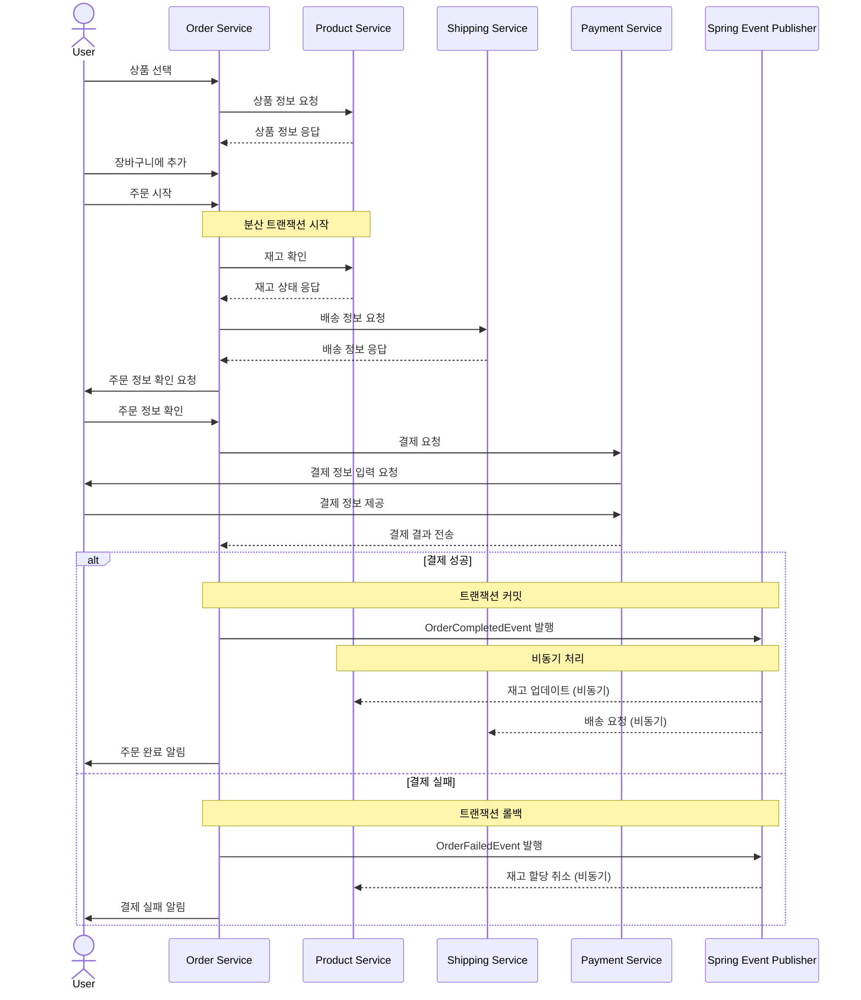

## 주문 서버 개발기 2편 (설계)
> 작성날짜: 24.09.11

### 📚 Table of Contents
해당 포스팅은 아래의 시리즈로 구성되어 있습니다. 시리즈대로 포스팅을 읽어주세요 🧑🏼‍🌾
1. [주문 서버 개발기 1편 (도메인)](https://github.com/hyunolike/dev-diary/blob/develop/inner-circle/%EC%A3%BC%EB%AC%B8%20%EC%84%9C%EB%B2%84%20%EA%B0%9C%EB%B0%9C%EA%B8%B0%201%ED%8E%B8%20(%EB%8F%84%EB%A9%94%EC%9D%B8).md)
2. [주문 서버 개발기 2편 (설계)](#)
---

### 설계 필요

- 주문과 연관된 도메인이 많음
    - 6가지 도메인 (회원, 주문, 상품, 장바구니, 결제, 배송)
- 이에 따른 통신, 트랜잭션 전략 등이 필요

### 주문은 어떻게 진행이 될까? (사용자 입장에서 살펴보자)

- 장바구니에 담긴 상품들을 정보를 기반으로 사용자, 배송 정보를 추가해 주문을 진행
- 여기서 주문은 결제, 배송과 한묶음!

### 주문 프로세스를 하나씩 설계해보자
#### 1. 내부 주문 프로세스 (서버 기준)

- 크게 4가지 서비스가 필요
- 멀티모듈 구조니까 각각 필요한 데이터를 관련된 도메인 서비스에서 불러오는 전략?

#### 2. 내부 주문 프로세스 (통신 전략)

- 그렇다면 각각의 통신은 크게 2가지
    - 내부 통신 (현재 배포는 하나의 클러스터에 여러개의 서버가 띄어진 상황)
    - 외부 통신 (타팀에서 제공 예정인 결제 서비스)
 
#### 3. 내부 주문 프로세스(서비스 사용 목적) 

- 각각의 서비스의 사용 목적을 정리
- 주문 서비스에 필요한 기능 나열

#### 4. 내부 주문 프로세스 (임시 응답값 처리 필요 파악)
> 여기서 임시 응답값 = 미 개발된 서비스

- 생각해보니 `배송 서비스` 말고도 `배송 처리 서비스` 는 ?
- 여기서 `배송 처리 서비스` 각 택배사 별 실시간 데이터 제공 서비스를 의미

#### 5. 내부 주문 프로세스 (다시 생각)

- 다시 생각! 현재 서버 프로젝트 구조는 `멀티 모듈`
- 멀티 모듈 != MSA 가 아니다!
- 그렇다면, 굳이 `server to server` 통신이 필요치 않음
- 주문 서비스에서 바로 데이터베이스를 이용해 필요한 데이터를 가져다 쓰자

### 필요한 기술들을 생각해보자
#### 1. 분산 트랜잭션 처리

- 만약 이렇게 하나의 데이터베이스가 아닌 개별 데이터베이스 구조이면 유명한 사가패턴, 2PC 기술을 사용
- 하지만 현 프로젝트에서는 한개의 데이터베이스 사용
- 굳이 위 2가지 기술을 사용할 필요가 없음 (아래처럼 개발해보자)

#### 2. 데이터베이스 이슈 발생 처리 (재처리 로직)

- 데이터베이스 이슈로 인해 비즈니스 로직 중간에 이슈가 발생한다면?
- `Spring Batch` 에서 독립적으로 나온 기술인 `Spring Retry` 기술을 사용해보자

#### 3. 외부 서비스간 처리 (결제 서비스)

- 트랜잭션 롤백 처리가 중요
- `Spring Event` 를 이용해 이벤트 발행을 해서 처리 (아래 참고 - 정리)

### 시퀀스 다이어그램을 그려보자

### 회고
- 생각보다 주문 API 개발에 신경써야 될 부분이 많음
- 도메인 이해 중요
- 이제는 필요한 기술들을 적용해서 개발해보자 🔥

