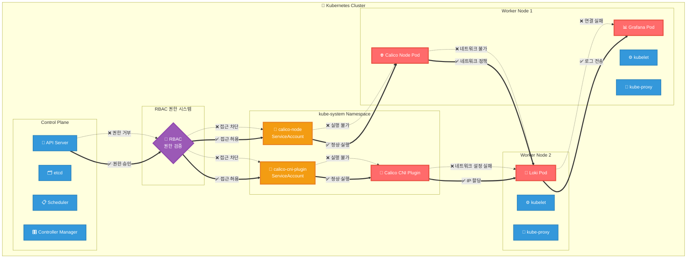

## 네트워크 권한 문제로 인한 Pod 연결 장애
> 작성날짜: 25.06.07

### 요약 설명
>  Kubernetes에서는 하나의 권한 문제가 전체 클러스터의 네트워크 인프라에 영향을 미치며, 근본 원인(RBAC)을 해결하면 모든 연결된 서비스가 연쇄적으로 복구됩니다! 🎯

### 문제 상황
- Calico(네트워크 관리자)가 신분증은 있지만 출입 권한이 없었음
- 권한 없이는 다른 Pod들에게 네트워크를 제공할 수 없음
- 결과적으로 Loki가 격리된 상태가 되어 Grafana와 통신 불가

### 왜 발생?
- Calico 설치 시 RBAC 설정이 누락되었거나
- 클러스터가 보안 강화 모드(--authorization-mode=RBAC)로 설정되어 있어서
- 기본적으로 모든 권한이 차단된 상태

### 해결 방법
- ClusterRoleBinding으로 필요한 권한을 명시적으로 부여
- Calico가 정상 작동하면서 모든 Pod의 네트워크 연결성 복구
- 연쇄적으로 Loki-Grafana 연결도 정상화

