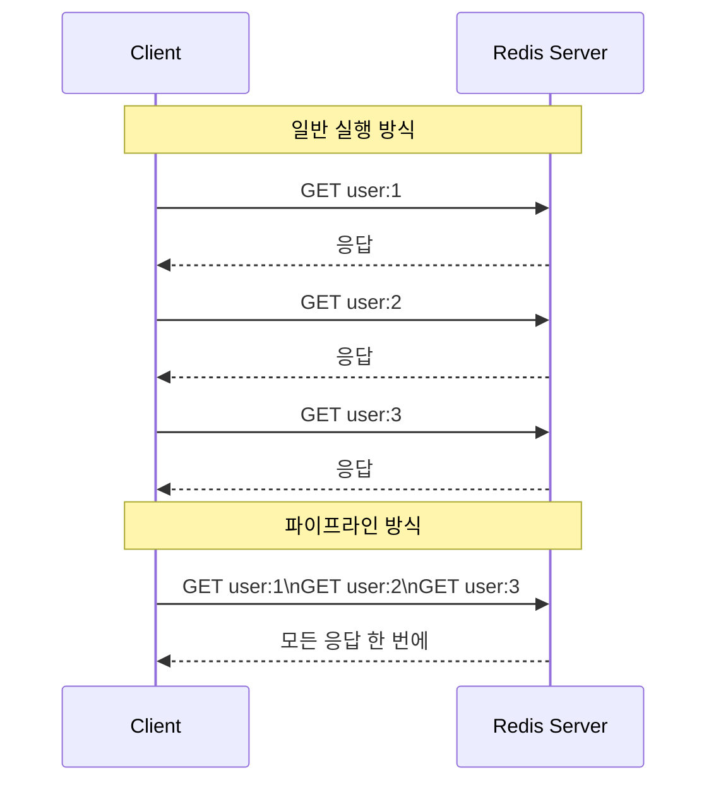

## Redis Local Hands-on (feat. redis key 문법)
> 작성날짜: 24.11.25

### 레디스를 로컬에서 테스트해보자
#### Docker 환경 내 준비사항
- redis

### docker-compose setting
```yml
version: '3.8'

services:
  redis:
    container_name: local-redis
    image: redis:latest
    ports:
      - "6379:6379"
    volumes:
      - redis_data:/data
    command: redis-server --appendonly yes
    restart: always

volumes:
  redis_data:
```

### 간단한 Redis 테스트 위한 단계별 가이드
#### 0. 기본적인 도커 명령어
```
- it 명령어: 
  - -i(interactive(대화형)): 대화형 모드로 표준 입력을 열어둠
  - -t(terminal): 터미널 할당하여 bash 셸을 올바르게 표시하고 사용
  이 2개의 옵션 사용 시, 컨테이너의 셸을 마치 로컬 터미널처럼  사용 가능!
```

#### 1. Redis  컨테이너 접속
```bash
docker exec -it local-redis bash
```

#### 2. redis-cli 실행
```bash
redis
```

#### 3. 테스트
```bash
문자열 테스트:

# 값 설정
SET name "Hong Gil Dong"
# 값 가져오기
GET name

# 값이 존재하는지 확인
EXISTS name

리스트 테스트:
# 리스트에 값 추가
LPUSH fruits apple
LPUSH fruits banana
RPUSH fruits orange

# 리스트 전체 조회
LRANGE fruits 0 -1

# 리스트 길이 확인
LLEN fruits

해시 테스트:
# 해시에 필드와 값 설정
HSET user:1 username "hong" email "hong@example.com" age "30"

# 해시의 모든 필드와 값 조회
HGETALL user:1

# 특정 필드 값 조회
HGET user:1 username

만료시간 테스트:
# 10초 후 만료되는 키 설정
SET temporary "will expire" EX 10

# 남은 만료 시간 확인
TTL temporary

# 10초 후에 다시 조회하면 키가 없어짐
GET temporary
```

### 👨‍🌾 Redis Key 문법을 알아보자
#### 키 네이밍 기본 규칙
- 최대 크기: 512MB (일반적으로 짧은 키 권장)
- 이진 안전(binary-safe): 모든 문자열 가능
- 가독성을 위해 일반적으로 ASCII 문자 사용
- 대소문자 구분

```bash
# 1. 객체 타입:엔티티ID
user:1000
product:2000
order:3000

# 2. 객체 타입:엔티티ID:속성
user:1000:profile
user:1000:settings
product:2000:reviews

# 3. 객체 타입:엔티티ID:집합
user:1000:followers
post:1000:likes
product:2000:tags

# 4. 기능:세부사항
cache:categories
search:recent
config:api

# 5. 시간 기반
events:2024-03-20
logs:2024:03:20:13
stats:daily:2024-03-20

# 6. 카운터
count:users
count:views:post:1000
seq:order
```


#### 일반적인 키 네이밍 컨벤션 (4) 


#### 키 네이밍 Best Practice
```bash
# 1. 계층적 구조 사용
company:1:department:2:employee:3

# 2. 검색을 위한 패턴
product:*          # 모든 제품
user:1000:*        # 특정 사용자의 모든 관련 키
order:2024-03-*    # 특정 월의 모든 주문

# 3. 임시 키 (TTL 적용)
temp:session:abc123
temp:verification:xyz789

# 4. 환경 구분
dev:users:1000
prod:users:1000
test:users:1000
```

#### 키 네이밍 실제 사용 예시
```bash
# 사용자 관련
SET user:1000:profile "{name:'John',age:30}"
HSET user:1000:settings theme "dark" language "ko"
SADD user:1000:followers "user:1001" "user:1002"

# 상품 관련
SET product:2000 "{name:'Phone',price:1000}"
LPUSH product:2000:reviews "{text:'Good',rating:5}"
SADD product:2000:categories "electronics" "mobile"

# 시스템 관련
INCR count:daily:visitors
ZADD ranking:products:daily 100 "product:2000"
SET session:token:abc123 "user:1000" EX 3600
```

#### 데이터 유형별 사용 사례
> [!NOTE]
> 각 자료형마다 적합한 사용 예시 존재


### 🔥 키 네이밍 주의사항 & 팁
- 아래와 같이 네이밍 규칙의 장점
    - 데이터 구조를 쉽게 이해할 수 있음
    - 키 충돌을 방지할 수 있음
    - 효율적인 키 검색이 가능함
    - 시스템 유지보수가 용이함

#### 🤣 키 길이
너무 긴 키는 메모리 낭비
적절한 길이로 의미 전달

```bash
# 좋은 예
user:1000:profile

# 나쁜 예
this:is:very:long:key:name:for:user:profile:data:1000
```

#### 🤣 일관성
같은 타입의 데이터는 같은 패턴 사용

```bash
# 좋은 예
user:1000:profile
user:1001:profile

# 나쁜 예
user:1000:profile
user_1001_profile
```

#### 🤣 검색 가능성
와일드카드로 검색 가능하게 설계

```bash
# 특정 사용자의 모든 데이터 검색
KEYS user:1000:*


# 특정 날짜의 모든 로그 검색
KEYS logs:2024-03-20:*
```

#### 🤣 특수문자 사용
: - 네임스페이스 구분
. - 상세 속성 구분
- - 가독성을 위한 구분

```bash
app:user:1000        # 네임스페이스
user.profile.image   # 속성
```

### 🔥 Redis Key 연결 및 조합
- 키 조합을 통해?
    - 복잡한 데이터 관계 표현 가능
    - 효율적인 데이터 검색과 조회 가능
    - 실시간 데이터 처리와 분석 가능
    - 다양한 비즈니스 로직 구현 가능
- 주의사항
    - 키 조합 연산은 메모리를 많이 사용할 수 있음
    - 복잡한 조합은 성능에 영향을 줄 수 있음
    - 임시 키 사용 시 적절한 삭제 필요
    - 데이터 일관성 유지 필요

#### 1. 파이프라인(Pipeline)을 사용한 다중 키 조회:
```bash
# 여러 키를 한 번에 조회
MGET user:1000 user:1000:profile user:1000:settings

# 파이프라인 예시
PIPELINE
GET user:1000
SMEMBERS user:1000:followers
LRANGE user:1000:posts 0 10
EXECUTE
```

#### 2. Set 연산을 통한 키 조합:
```bash
# 두 사용자의 공통 팔로워 찾기
SINTER user:1000:followers user:1001:followers

# 사용자 A의 팔로워 중 사용자 B의 팔로워가 아닌 사람들
SDIFF user:1000:followers user:1001:followers

# 두 사용자의 모든 팔로워 통합
SUNION user:1000:followers user:1001:followers

```

#### 3. Sorted Set 연산 예시:
```bash
# 여러 제품 카테고리의 인기 상품 통합 랭킹
ZUNIONSTORE popular:products 2 popular:electronics popular:clothing WEIGHTS 1 1

# 특정 기간의 사용자 활동 점수 합산
ZUNIONSTORE user:1000:activity:total 3 
    user:1000:posts:score 
    user:1000:comments:score 
    user:1000:likes:score
```

### 그렇다면 키 조합하고 일반적인 RDBMS의 JOIN하고 비슷한거 아닌가?


### 키 조합에서 나온 `Redis Pipeline` 이란
> [!NOTE]
> 파이프라인은 여러 Redis 명령어를 한 번에 묶어서 실행하는 방식



### `Redis namespace` 는?
> [!NOTE]
> 네임스페이스는 키를 논리적으로 그룹화하는 방식

### redis pipeline, redis namespace 고려사항
|redis pipeline|redis namespace|
|-|-|
|너무 많은 명령어를 한 번에 보내지 않기 <br/>메모리 사용량 고려 <br/>에러 처리 중요|일관된 네이밍 규칙 사용<br/>키 충돌 방지<br/>검색 가능성 고려|


#### redis 추가된 코틀린 예시 코드
```kotlin
// 사용자 데이터 모델
data class UserProfile(
    val id: String,
    val name: String,
    val email: String,
    val followers: Set<String> = emptySet(),
    val following: Set<String> = emptySet(),
    val posts: List<String> = emptyList()
)

// Redis 작업을 처리하는 Repository
class UserRedisRepository(private val redis: RedisCommands<String, String>) {
    // 네임스페이스 정의
    companion object {
        const val USER_NS = "user"
        const val PROFILE_NS = "profile"
        const val FOLLOWERS_NS = "followers"
        const val FOLLOWING_NS = "following"
        const val POSTS_NS = "posts"
    }

    // 키 생성 헬퍼 함수
    private fun createKey(vararg parts: String) = parts.joinToString(":")

    // 파이프라인을 사용한 사용자 프로필 조회
    suspend fun getUserProfile(userId: String): UserProfile {
        return coroutineScope {
            redis.async().let { async ->
                // 병렬로 여러 데이터 조회
                val basicInfo = async { 
                    async.hgetall(createKey(USER_NS, userId))
                }
                val followers = async {
                    async.smembers(createKey(USER_NS, userId, FOLLOWERS_NS))
                }
                val following = async {
                    async.smembers(createKey(USER_NS, userId, FOLLOWING_NS))
                }
                val posts = async {
                    async.lrange(createKey(USER_NS, userId, POSTS_NS), 0, 10)
                }

                // 모든 데이터 수집
                UserProfile(
                    id = userId,
                    name = basicInfo.await()["name"] ?: "",
                    email = basicInfo.await()["email"] ?: "",
                    followers = followers.await(),
                    following = following.await(),
                    posts = posts.await()
                )
            }
        }
    }

    // 팔로우 기능 구현
    suspend fun followUser(followerId: String, targetId: String) {
        redis.async().let { async ->
            async.multi().apply {
                // 팔로잉 추가
                sadd(createKey(USER_NS, followerId, FOLLOWING_NS), targetId)
                // 팔로워 추가
                sadd(createKey(USER_NS, targetId, FOLLOWERS_NS), followerId)
            }.exec()
        }
    }

    // 포스트 작성 기능
    suspend fun createPost(userId: String, content: String) {
        val postId = "post:${System.currentTimeMillis()}"
        
        redis.async().let { async ->
            async.multi().apply {
                // 포스트 내용 저장
                hset(postId, mapOf(
                    "userId" to userId,
                    "content" to content,
                    "timestamp" to System.currentTimeMillis().toString()
                ))
                
                // 사용자의 포스트 목록에 추가
                lpush(createKey(USER_NS, userId, POSTS_NS), postId)
                
                // 팔로워들의 피드에 추가
                async.smembers(createKey(USER_NS, userId, FOLLOWERS_NS)).get().forEach { followerId ->
                    lpush(createKey(USER_NS, followerId, "feed"), postId)
                }
            }.exec()
        }
    }
}

// Spring Boot에서 사용 예시
@Service
class UserService(private val userRedisRepository: UserRedisRepository) {
    
    suspend fun getUserProfile(userId: String): UserProfile {
        return userRedisRepository.getUserProfile(userId)
    }
    
    suspend fun followUser(followerId: String, targetId: String) {
        userRedisRepository.followUser(followerId, targetId)
    }
    
    suspend fun createPost(userId: String, content: String) {
        userRedisRepository.createPost(userId, content)
    }
}
```
