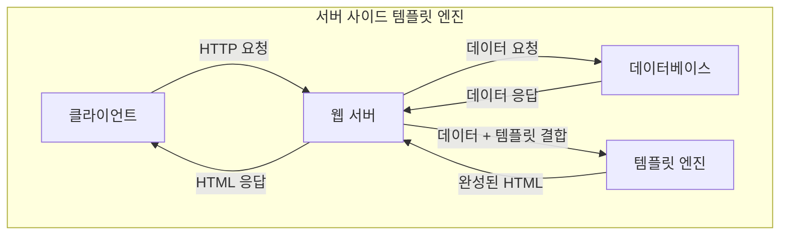
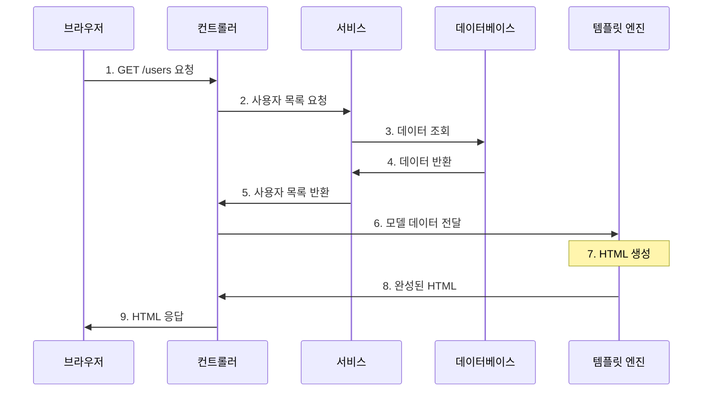
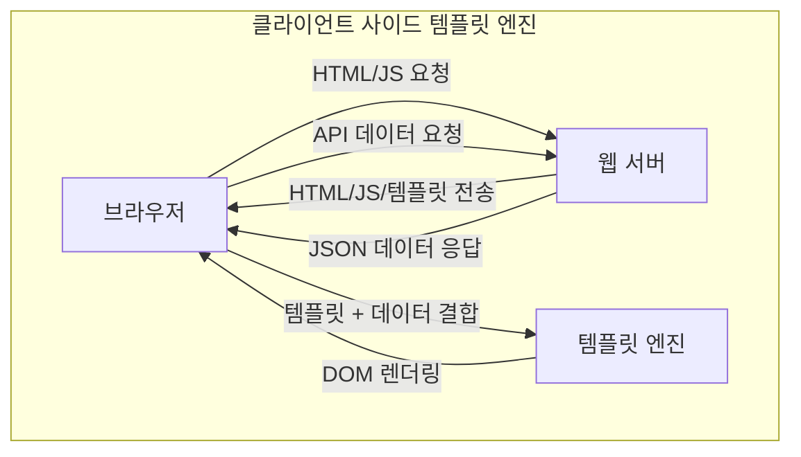

## Template Engine (View Template)에 대해 알아보자
> 작성날짜: 24.11.27


### 템플릿 엔진?
- 템플릿 엔진은 템플릿 양식과 특정 데이터 모델에 따른 입력 자료를 합성하여 결과 문서를 출력하는 소프트웨어 또는 소프트웨어 컴포넌트
- 웹 개발 관점에서는 지정된 템플릿 양식과 데이터가 합쳐져 HTML 문서를 출력하는 소프트웨어를 의미
### 템플릿 엔진 특징 
1. 코드 간소화
    - 템플릿 엔진을 사용하면 기존 HTML에 비해 간단한 문법을 사용하여 코드를 훨씬 간결하게 작성
2. 재사용성
    - 동일한 디자인의 페이지에 데이터만 변경하는 경우가 많은 웹 페이지 개발에서, 템플릿 엔진은 미리 만들어진 템플릿을 재사용하여 효율적으로 페이지를 생성
3. 유지보수 용이성
    - 하나의 템플릿을 관리하는 것이 여러 개의 유사한 HTML 페이지를 관리하는 것보다 효율적이므로 유지보수가 용이
  
### 템플릿 엔진 종류
> 크게 2가지로 분류 (서버 사이드, 클라이언트 사이드)


#### 1. 서버 사이드 템플릿 엔진
> [!NOTE]
> JSP, Thymeleaf, Velocity, Freemarker <br/>
> 서버 사이드는 모든 처리가 서버에서 이루어지고 완성된 HTML만 전달

- 서버에서 DB 또는 API에서 가져온 데이터를 미리 정의된 템플릿에 넣어 HTML 문서를 만들어 클라이언트에 전달



##### 1-1. 서버 사이드 템플릿 엔진 특징
- 서버에서 HTML을 완성하여 클라이언트로 전송
- 초기 로딩 속도가 빠름
- SEO에 유리
- 서버 부하가 상대적으로 높음
- 페이지 변경 시 전체 새로고침 필요

##### 1-2. 서버 사이드 템플릿 엔진의 동작 과정



```java
// 1. Controller - 요청 처리 및 모델 데이터 준비
@Controller
public class UserController {
    
    @Autowired
    private UserService userService;
    
    @GetMapping("/users")
    public String getUserList(Model model) {
        // 서비스 계층에서 사용자 목록 조회
        List<User> users = userService.findAll();
        
        // 템플릿에서 사용할 데이터를 모델에 추가
        model.addAttribute("users", users);
        model.addAttribute("pageTitle", "사용자 목록");
        
        // 템플릿 파일명 반환 (users.html)
        return "users";
    }
}

// 2. Service - 비즈니스 로직 처리
@Service
public class UserService {
    
    @Autowired
    private UserRepository userRepository;
    
    public List<User> findAll() {
        return userRepository.findAll();
    }
}

// 3. Entity - 데이터 모델
@Entity
public class User {
    @Id
    private Long id;
    private String name;
    private String email;
    private String role;
    // getter, setter 생략
}

// 4. Template (users.html) - Thymeleaf 템플릿
<!DOCTYPE html>
<html xmlns:th="http://www.thymeleaf.org">
<head>
    <title th:text="${pageTitle}">사용자 목록</title>
    <link rel="stylesheet" th:href="@{/css/styles.css}">
</head>
<body>
    <div class="container">
        <h1 th:text="${pageTitle}">사용자 목록</h1>
        
        <!-- 사용자가 없는 경우 -->
        <div th:if="${#lists.isEmpty(users)}" class="alert">
            등록된 사용자가 없습니다.
        </div>
        
        <!-- 사용자 목록 표시 -->
        <div th:unless="${#lists.isEmpty(users)}" class="user-list">
            <div th:each="user : ${users}" class="user-card">
                <h3 th:text="${user.name}">사용자 이름</h3>
                <p th:text="'이메일: ' + ${user.email}">이메일</p>
                <p th:text="'역할: ' + ${user.role}">역할</p>
                
                <!-- 조건부 렌더링 예시 -->
                <span th:if="${user.role == 'ADMIN'}" class="admin-badge">
                    관리자
                </span>
            </div>
        </div>
    </div>
</body>
</html>

// 5. application.properties - 설정
spring.thymeleaf.cache=false
spring.thymeleaf.prefix=classpath:/templates/
spring.thymeleaf.suffix=.html
```


1. 요청 단계
    - 브라우저가 /users URL로 GET 요청
    - 스프링의 DispatcherServlet이 요청을 UserController로 라우팅
2. 컨트롤러 처리
    - UserController가 요청을 받아 처리
    - UserService를 통해 필요한 데이터 조회
    - Model 객체에 데이터 추가
    - 사용할 템플릿 이름 반환 ("users")
3. 서비스 로직
    - UserService에서 비즈니스 로직 처리
    - 데이터베이스에서 사용자 목록 조회
    - 필요한 데이터 가공
4. 템플릿 처리
    - Thymeleaf 엔진이 users.html 템플릿을 로드
    - 템플릿의 특수 태그(th:text 등)를 실제 데이터로 치환
    - 조건문(th:if)과 반복문(th:each) 처리
    - 최종 HTML 생성
5. 응답 생성
    - 생성된 HTML을 클라이언트에 전송
    - 브라우저가 받은 HTML을 렌더링

##### 🎄 주요 특징. 
1. 서버에서 완성돈 HTML만 받음
    - 클라이언트는 완성된 HTML만 받음
    - JavaScript가 없어도 페이지 표시 가능\
2. 템플릿 문법

```
th:text="${변수}" - 텍스트 출력
th:each="item : ${items}" - 반복 처리
th:if="${조건}" - 조건부 렌더링
th:href="@{/경로}" - URL 처리
```

3. 캐싱 기능
    - 템플릿을 캐시하여 성능 최적화
    - 개발 시에는 캐시를 비활성화하여 즉시 반영
##### 1-3. 장단점 
- 장점
    - 검색 엔진 최적화(SEO)에 유리
    - 초기 페이지 로딩 빠름
    - 서버에서 모든 처리를 완료하여 보안에 유리
    - 클라이언트 리소스 사용 최소화
- 단점
    - 서버 부하가 상대적으로 높음
    - 페이지 일부 갱신 시에도 전체 페이지 새로고침 필요
    - 서버 자원 사용량이 많음
- 사용 적합 상황
    - SEO가 중요한 경우
    - 정적인 콘텐츠가 많은 경우
    - 초기 로딩 속도가 중요한 경우
    - 클라이언트의 성능이 제한적인 경우


#### 2. 클라이언트 사이드 템플릿 엔진
> [!NOTE]
> Mustache, Squirrelly, Handlebars.js, EJS <br/>
> 클라이언트 사이드는 템플릿과 데이터를 따로 받아서 브라우저에서 조합

- HTML 형태로 코드를 작성할 수 있으며, 동적으로 DOM을 그리는 역할



##### 2-1. 클라이언트 사이드 템플릿 엔진 특징
- 브라우저에서 HTML을 동적으로 생성
- 서버 부하가 상대적으로 낮음
- 부분 업데이트가 가능하여 사용자 경험이 좋음
- 초기 로딩 시 JavaScript 파일을 다운로드해야 함
- SEO에 상대적으로 불리할 수 있음

##### 2-2. 클라이언트 사이드 템플릿 엔진의 동작 과정
```html
<!-- 1. 초기 HTML 파일 (index.html) -->
<!DOCTYPE html>
<html>
<head>
    <title>사용자 목록</title>
    <!-- 2. 템플릿 엔진(Handlebars) 라이브러리 로드 -->
    <script src="https://cdnjs.cloudflare.com/ajax/libs/handlebars.js/4.7.7/handlebars.min.js"></script>
</head>
<body>
    <!-- 3. 실제 데이터가 들어갈 컨테이너 -->
    <div id="userList"></div>

    <!-- 4. 템플릿 정의 -->
    <script id="user-template" type="text/x-handlebars-template">
        <h2>사용자 목록</h2>
        <div class="user-container">
            {{#each users}}
                <div class="user-card">
                    <h3>{{name}}</h3>
                    <p>이메일: {{email}}</p>
                    <p>역할: {{role}}</p>
                </div>
            {{/each}}
        </div>
    </script>

    <!-- 5. 실제 동작하는 JavaScript 코드 -->
    <script>
        // 템플릿을 컴파일
        const template = Handlebars.compile(
            document.getElementById('user-template').innerHTML
        );

        // API에서 데이터 가져오기
        fetch('https://api.example.com/users')
            .then(response => response.json())
            .then(data => {
                // 데이터 예시
                const userData = {
                    users: [
                        { name: "김철수", email: "kim@example.com", role: "관리자" },
                        { name: "이영희", email: "lee@example.com", role: "사용자" }
                    ]
                };

                // 템플릿과 데이터를 결합하여 HTML 생성
                const renderedHTML = template(userData);

                // 생성된 HTML을 페이지에 삽입
                document.getElementById('userList').innerHTML = renderedHTML;
            });
    </script>

    <style>
        .user-container {
            display: flex;
            gap: 20px;
        }
        .user-card {
            border: 1px solid #ddd;
            padding: 15px;
            border-radius: 8px;
        }
    </style>
</body>
</html>
```


1. 초기 페이지 로드
    - 사용자가 웹사이트 접속
    - 서버는 기본 HTML, JavaScript, CSS를 전송
    - 이 단계에서는 실제 데이터가 없는 빈 페이지 상태
2. 템플릿 준비
    - Handlebars와 같은 템플릿 엔진 라이브러리 로드
    - HTML 안에 템플릿 코드가 script 태그로 정의됨
    - 템플릿에는 {{name}}, {{email}} 같은 변수 플레이스홀더 포함
3. 데이터 요청
    - JavaScript가 API 서버에 데이터 요청 (fetch 사용)
    - 서버는 JSON 형태로 데이터 응답
4. 템플릿과 데이터 결합
    - 받은 JSON 데이터를 템플릿과 결합
    - Handlebars가 {{name}}을 실제 데이터 "김철수"로 치환
    - 최종 HTML 코드 생성
5. DOM 업데이트
    - 생성된 HTML을 페이지의 특정 부분(#userList)에 삽입
    - 브라우저가 새로운 HTML을 렌더링
    - 사용자에게 최종 결과물 표시
  
##### 2-3. 장단점
- 장점
    - 페이지 전체를 다시 로드하지 않고 필요한 부분만 업데이트
    - 서버 부하 감소 (HTML 생성을 브라우저가 담당)
    - 동적인 데이터 업데이트 용이
    - 사용자 경험 향상 (빠른 반응성)
- 단점
    - 초기 JavaScript 로딩 시간 필요
    - 검색 엔진 최적화(SEO)가 상대적으로 어려움
    - 클라이언트 기기의 성능에 영향을 받음

### 사용 예시 (클라이언트 사이드)


