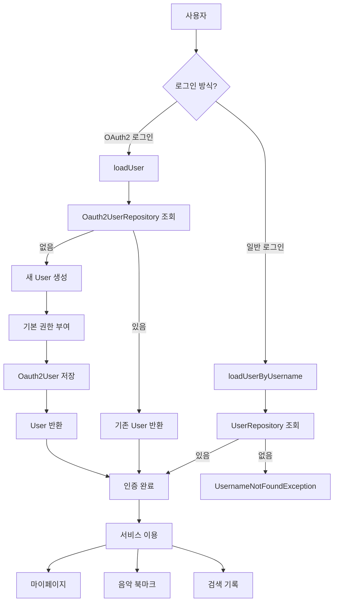

## `가사를 쉽게 간직하고 공유,Mute 프로젝트` 개발일지 #0. `🛠️ 기능 개발` Spring Security OAuth2 - Enum을 활용한 소셜 로그인 응답 데이터 변환 전략
> 작성날짜: 24.11.17 </br>
> 프로젝트 링크: https://github.com/hyunolike/mute

### 개발 완료 모습


### 주요 사항
- Enum을 활용한 해결
- 다중 소셜 로그인 구축

### 개발 현황 구조 (요약)


### 개발 코드
> [!TIP]
> 각 소셜 로그인 제공자(Google, Facebook, Naver, Kakao)의 서로 다른 응답 데이터를 추상 메서드를 통해 표준화된 Oauth2User 객체로 변환하는 열거형 타입

```java
    public static enum OAuth2Provider {
        google {
            public Oauth2User convert(OAuth2User user) {
                return Oauth2User.builder()
                        .oauth2UserId(format("%s_%s", name(), user.getAttribute("sub")))
                        .provider(google)
                        .email(user.getAttribute("email"))
                        .name(user.getAttribute("name"))
                        .created(LocalDateTime.now())
                        .build();
            }
        },
        facebook {
            public Oauth2User convert(OAuth2User user) {
                return Oauth2User.builder()
                        .oauth2UserId(format("%s_%s", name(), user.getAttribute("id")))
                        .provider(facebook)
                        .email(user.getAttribute("email"))
                        .name(user.getAttribute("name"))
                        .created(LocalDateTime.now())
                        .build();
            }
        },
        naver {
            public Oauth2User convert(OAuth2User user) {
                Map<String, Object> resp = user.getAttribute("response");
                return Oauth2User.builder()
                        .oauth2UserId(format("%s_%s", name(), resp.get("id")))
                        .provider(naver)
                        .email("" + resp.get("email"))
                        .name("" + resp.get("name"))
                        .build();
            }
        },
        kakao {
            public Oauth2User convert(OAuth2User user) {
                Map<String, Object> resp = user.getAttribute("kakao_account");
                Map<String, Object> profile = user.getAttribute("properties");
                return Oauth2User.builder()
                        .oauth2UserId(format("%s_%s", name(), user.getAttribute("id")))
                        .provider(kakao)
                        .email("" + resp.get("email"))
                        .name("" + profile.get("nickname"))
                        .build();
            }
        };

        public abstract Oauth2User convert(OAuth2User user);
    }
```

#### 추가 설명
- 추상 메서드(`convert`): 모든 소셜 로그인이 반드시 구현
- 각 소셜 로그인별 다른 데이터 형식

| 소셜 로그인 | ID 필드 | 이메일/이름 위치 | 특이사항 |
|-----------|-----------|---------------|-----------|
| Google | sub | 최상위 | `email`, `name` 필드 직접 접근 |
| Facebook | id | 최상위 | `email`, `name` 필드 직접 접근 |
| Naver | id | response 맵 | `response.get("email")`, `response.get("name")` |
| Kakao | id | kakao_account, properties 맵 | `kakao_account.get("email")`, `properties.get("nickname")` |

데이터 접근 예시:
```java
// Google, Facebook
user.getAttribute("email")
user.getAttribute("name")

// Naver
Map<String, Object> response = user.getAttribute("response");
response.get("email")
response.get("name")

// Kakao
Map<String, Object> kakao_account = user.getAttribute("kakao_account");
Map<String, Object> properties = user.getAttribute("properties");
kakao_account.get("email")
properties.get("nickname")
```

### 인증 프로세스 요약


### 프로젝트에 적용된 주요 특징은?
- Enum을 사용해 각 제공자별 변환 로직을 깔끔하게 캡슐화
- `추상 메서드` 로 각 eunm 상수가 반드시 구현해야 하는 메서드 정의
- enum 상수별 구현 (추상 메서드 개별적으로 구현)
  - 익명 클래스 형태로 구현
 
#### 추상 메서드란
- 선언만 있고 구현이 없는 메서드
- abstract 키워드 사용
- 하위 클래스에서 반드시 구현

### 데이터 변환 과정
```
소셜 로그인 응답
     ↓
getAttribute로 데이터 추출
     ↓
필요한 정보 매핑 및 변환
     ↓
Oauth2User 객체로 표준화
```

### 해당 구현 장점은?
> [!IMPORTANT]
> 각 소셜 로그인 제공자의 서로 다른 응답 형식을 일관된 방식으로 처리 가능

1. 타입 안정성 보장
2. 컴파일 타엠이 모든 케이스 처리 보장
3. 중복 코드 최소화
4. 새로운 제공자 추가가 용이
5. 응답 형식 변환 로직을 한 곳에서 관리


### 추가. enum 내 `추상 메서드` vs `일반 메서드` 차이
#### 추상 메서드
> [!TIP]
> 모든 자식이 반드시 구현 (필수)

- "모든 동물은 반드시 소리를 내야 한다!"


```java
public enum Animal {
    DOG {
        @Override
        public String makeSound() { return "멍멍"; }
    },
    CAT {
        @Override
        public String makeSound() { return "야옹"; }
    };

    public abstract String makeSound(); // 무조건 구현해야 함
}
```

- 특징
  - 빈 틀만 제공, 각자 반드시 구현
- 실생활
  - 시험문제처럼 반드시 답을 작성해야하는 것

#### 일반 메서드
> [!TIP]
> 기본 구현 제공, 필요시만 수정 (선택)

- "기본적으로 동물은 다리가 4개, 특별한 동물만 다르게 설정"

```java
public enum Animal {
    DOG,    // 기본값 사용 (다리 4개)
    BIRD {  // 다리 2개로 오버라이드
        @Override
        public int getLegCount() { return 2; }
    };

    public int getLegCount() { return 4; } // 기본값 제공
}
```

- 특징
  - 기본값을 제공, 필요한 경우만 수정
- 실생활
  - 기본 설정값이 있는 핸드폰, 필요한 경우만 설정 변경

### 추가. enum의 다양한 실무 사례 분석
#### 1. 상태(Status) 관리
```java
public enum OrderStatus {
    // 각 enum 상수에서 기본 구현을 선택적으로 오버라이드
    PENDING("주문대기", false) {
        @Override
        public boolean canCancel() { return true; }
    },
    PAYMENT_COMPLETED("결제완료", false) {
        @Override
        public boolean canCancel() { return true; }
    },
    PREPARING("상품준비중", false) {
        @Override
        public boolean canCancel() { return false; }
    },
    // 기본 구현을 사용하는 상수들
    DELIVERED("배송완료", true),    // 기본 false 반환
    CANCELLED("주문취소", false);   // 기본 false 반환

    private final String description;
    private final boolean isShipped;

    // 생성자
    OrderStatus(String description, boolean isShipped) {
        this.description = description;
        this.isShipped = isShipped;
    }

    // 기본 구현을 가진 일반 메서드
    public boolean canCancel() { 
        return false;  // 기본값으로 false 반환
    }

    public String getDescription() { 
        return description; 
    }
}
```

#### 2. 타입 코드 및 에러 코드 관리
```java
public enum ErrorCode {
    // 공통 에러
    INVALID_INPUT_VALUE(400, "C001", "잘못된 입력값입니다"),
    METHOD_NOT_ALLOWED(405, "C002", "허용되지 않는 메서드입니다"),
    INTERNAL_SERVER_ERROR(500, "C003", "서버 에러"),
    
    // 비즈니스 에러
    DUPLICATE_EMAIL(400, "B001", "중복된 이메일입니다"),
    USER_NOT_FOUND(404, "B002", "사용자를 찾을 수 없습니다"),
    INSUFFICIENT_BALANCE(400, "B003", "잔액이 부족합니다");

    private final int status;
    private final String code;
    private final String message;

    // 생성자
    ErrorCode(int status, String code, String message) {
        this.status = status;
        this.code = code;
        this.message = message;
    }
}
```

#### 3. 권한 관리
```java
public enum Role {
    ADMIN("ROLE_ADMIN", "관리자", Arrays.asList(
        Permission.READ_USERS,
        Permission.WRITE_USERS,
        Permission.DELETE_USERS
    )),
    MANAGER("ROLE_MANAGER", "매니저", Arrays.asList(
        Permission.READ_USERS,
        Permission.WRITE_USERS
    )),
    USER("ROLE_USER", "일반사용자", Arrays.asList(
        Permission.READ_USERS
    ));

    private final String key;
    private final String title;
    private final List<Permission> permissions;

    public boolean hasPermission(Permission permission) {
        return permissions.contains(permission);
    }
}
```

#### 4. 결제 수단 관리
```java
public enum PaymentMethod {
    CARD("신용카드") {
        @Override
        public PaymentResult process(Payment payment) {
            // 카드 결제 처리 로직
            return cardPaymentService.process(payment);
        }
    },
    BANK_TRANSFER("계좌이체") {
        @Override
        public PaymentResult process(Payment payment) {
            // 계좌이체 처리 로직
            return bankTransferService.process(payment);
        }
    },
    VIRTUAL_ACCOUNT("가상계좌") {
        @Override
        public PaymentResult process(Payment payment) {
            // 가상계좌 처리 로직
            return virtualAccountService.process(payment);
        }
    };

    private final String description;
    public abstract PaymentResult process(Payment payment);
}
```

#### 5. API 버전 관리
```java
public enum ApiVersion {
    V1("v1", true) {
        @Override
        public String process(String request) {
            // V1 처리 로직
            return "V1 처리 결과";
        }
    },
    V2("v2", true) {
        @Override
        public String process(String request) {
            // V2 처리 로직
            return "V2 처리 결과";
        }
    },
    V3("v3", false) {  // deprecated version
        @Override
        public String process(String request) {
            throw new DeprecatedException("V3는 더 이상 지원하지 않습니다.");
        }
    };

    private final String version;
    private final boolean supported;
    
    public abstract String process(String request);
}
```

