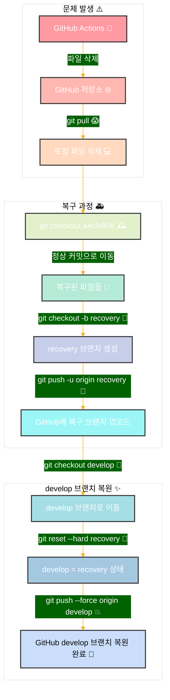

## 기술 블로그 구축  `🛠️ 기능 개발` 배포 중 깃 복구 과정
> 작성날짜: 25.04.10


### 전체 요약


#### 1. 문제 발생 단계 ⚠️
- GitHub Actions가 실수로 파일들을 삭제
- GitHub 저장소에 변경사항이 반영됨
- 로컬에서 git pull을 받아 파일들이 로컬에서도 삭제됨

#### 2. 복구 과정 🚑
- `git checkout a4c8d64f`로 정상 커밋으로 돌아감
- 해당 커밋에서 파일들이 복구됨
- `git checkout -b recovery`로 복구 브랜치 생성
- 복구 브랜치를 GitHub에 업로드


```shell
git push -u origin recovery
```

#### 3. develop 브랜치 복원 ✨
- develop 브랜치로 이동
- recovery 브랜치의 상태로 강제 리셋
- 변경된 develop 브랜치를 GitHub에 강제 푸시
- 최종적으로 develop 브랜치가 복원 완료 🎉


```shell
git checkout develop
# 이 명령어는 develop 브랜치로 이동합니다.
# 현재 작업 디렉토리가 develop 브랜치의 상태로 변경됩니다.
# 이 시점에서는 아직 파일들이 삭제된 상태입니다.

git reset --hard recovery
# 이 명령어는 develop 브랜치의 상태를 recovery 브랜치와 동일하게 만듭니다.
# --hard 옵션은 작업 디렉토리의 파일들까지 완전히 변경한다는 의미입니다.
# 결과적으로 develop 브랜치가 recovery 브랜치(복구된 상태)와 완전히 동일해집니다.
# 이 명령 실행 후 작업 디렉토리에는 복구된 모든 파일이 나타납니다.

git push --force origin develop
# 이 명령어는 변경된 develop 브랜치를 원격 저장소(origin)에 강제로 푸시합니다.
# --force 옵션은 원격 저장소의 develop 브랜치를 로컬의 상태로 강제 덮어쓰기 합니다.
# 일반적인 푸시는 원격 브랜치가 로컬 브랜치의 직접적인 조상이 아닐 때 거부되지만, --force 옵션은 이를 무시하고 강제로 푸시합니다.
# 이 명령을 실행하면 GitHub의 develop 브랜치가 복구된 상태로 업데이트됩니다.
```


