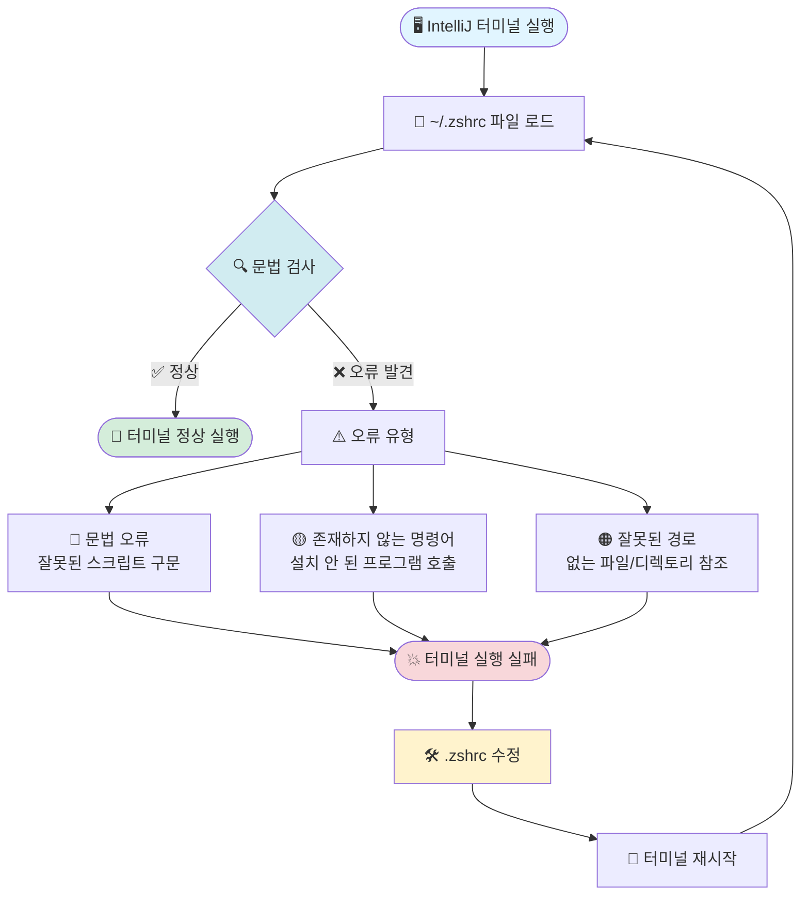

# macOS + zsh 환경 설정 완벽 가이드 (.zprofile vs .zshrc)

## 🧭 한 문장 요약

**.zprofile**은 "로그인할 때 한 번 실행"되고,
**.zshrc**는 "터미널을 열 때마다 실행"된다.

---

## 🧠 개념 정리

| 구분 | .zprofile | .zshrc |
|------|-----------|---------|
| **언제 실행됨** | 로그인 시 한 번 (login shell) | 터미널 창 열릴 때마다 (interactive shell) |
| **실행 주체** | macOS 로그인 / iTerm 첫 실행 | IntelliJ, VSCode, iTerm 새 탭, etc |
| **역할** | "환경 변수 설정" 중심 | "셸 사용자 설정" 중심 |
| **IntelliJ 터미널에서 읽힘** | ❌ 안 읽힘 | ✅ 읽힘 |
| **macOS 기본 터미널에서 읽힘** | ✅ 읽힘 | ✅ 읽힘 |
| **대표 설정 예시** | PATH, JAVA_HOME, NVM, PYENV | alias, prompt, tmux, export PS1 등 |
| **호출 관계** | .zprofile → .zshrc (원하면 수동 호출 가능) | 독립 실행 |

---

## 📘 실제 예시

### 🩵 .zprofile (로그인 셸)

macOS 로그인할 때, 시스템 전역 환경을 한 번 세팅

```bash
# 시스템 PATH 설정 (Homebrew, Java 등)
export PATH="/opt/homebrew/bin:$PATH"
export JAVA_HOME=$(/usr/libexec/java_home)

# Node Version Manager 초기화
export NVM_DIR="$HOME/.nvm"
[ -s "$NVM_DIR/nvm.sh" ] && \. "$NVM_DIR/nvm.sh"
```

> 💡 macOS에서는 GUI 앱들도 이 환경을 상속하기 때문에,
> 여기 설정이 없으면 IntelliJ·VSCode 같은 앱이 brew, node를 못 찾을 수 있어요.

---

### 💜 .zshrc (인터랙티브 셸)

터미널 새로 열릴 때마다 적용되는 설정

```bash
# 터미널 인터랙션용 설정
alias ll='ls -al'
alias gs='git status'

# 프롬프트, 테마
export PS1="%n@%m %1~ %# "

# IntelliJ에서 환경이 안 잡히면 아래처럼 중복 선언도 가능
export PATH="/opt/homebrew/bin:$PATH"
export NVM_DIR="$HOME/.nvm"
[ -s "$NVM_DIR/nvm.sh" ] && . "$NVM_DIR/nvm.sh"
```

> 💡 IntelliJ 터미널은 "비로그인 zsh"로 열리기 때문에
> .zprofile은 안 읽고 .zshrc만 읽습니다.

---

## ⚙️ 실무 팁

| 상황 | 실행되는 파일 |
|------|---------------|
| macOS 로그인 후 첫 터미널 실행 | .zprofile → .zshrc |
| 새 터미널 탭 열기 | .zshrc만 |
| IntelliJ, VSCode 터미널 | .zshrc만 |
| GUI 앱 (IntelliJ, PyCharm 등) 실행 | .zprofile만 (로그인 셸 환경 상속) |

---

## ✅ 정리 요약

| 항목 | .zprofile | .zshrc |
|------|-----------|---------|
| **실행 시점** | 로그인 시 (1회) | 터미널 열 때마다 |
| **IntelliJ 터미널에서 읽힘** | ❌ | ✅ |
| **macOS 기본 터미널** | ✅ | ✅ |
| **PATH / NVM / PYENV 설정** | ✅ | ✅ (IDE용 복사 필요) |
| **alias, prompt 등** | ❌ | ✅ |

---

## 💡 가장 좋은 방법

```bash
# ~/.zshrc 맨 위에 추가
if [ -f ~/.zprofile ]; then
  source ~/.zprofile
fi
```

👉 이렇게 하면 IntelliJ 터미널에서도 .zprofile 설정이 함께 불립니다.
(즉, 한쪽만 관리해도 됨)

---

## 🎯 핵심 포인트

1. **로그인 셸 (Login Shell)**
   - `.zprofile` 실행
   - 시스템 전역 환경 변수 설정
   - GUI 앱들이 이 환경을 상속

2. **인터랙티브 셸 (Interactive Shell)**
   - `.zshrc` 실행
   - 터미널 사용자 설정 (alias, prompt 등)
   - IDE 터미널들은 대부분 이 방식

3. **권장 구조**
   - 환경 변수 → `.zprofile`
   - 터미널 설정 → `.zshrc`
   - IDE 터미널 호환성 → `.zshrc`에서 `.zprofile` source

---

## 📚 참고사항

- macOS는 로그인 시 login shell을 실행하므로 `.zprofile`이 먼저 읽힘
- 일반적인 터미널 탭은 interactive shell이므로 `.zshrc`만 읽힘
- IntelliJ, VSCode 등의 IDE 터미널은 interactive non-login shell로 열림
- 따라서 IDE 터미널에서 PATH가 안 잡히는 문제는 `.zshrc`에 PATH 설정을 추가하거나 `.zprofile`을 source하면 해결됨

---

## 🔧 트러블슈팅: IntelliJ 터미널 오류

### 😱 문제 상황

IntelliJ 터미널이 갑자기 실행되지 않거나, 터미널을 열 때 에러 메시지가 나타나는 경우가 있습니다.

**주요 원인:** `.zshrc` 파일에 잘못된 설정이나 문법 오류가 있을 때 발생

### 📊 문제 발생 플로우



### ✅ 해결 방법

#### 1️⃣ **문제가 있는 설정 찾기**

터미널이 열리지 않는다면, 다른 터미널(기본 macOS Terminal.app 등)에서 확인:

```bash
# .zshrc 파일 직접 실행해서 에러 확인
zsh -xv ~/.zshrc
```

#### 2️⃣ **문제 설정 제거 또는 주석 처리**

```bash
# 에러를 일으키는 라인을 찾아서 주석 처리
# export WRONG_SETTING="잘못된 값"  # ← 이렇게 주석 처리

# 또는 완전히 삭제
```

#### 3️⃣ **IntelliJ 터미널 재시작**

- IntelliJ를 완전히 종료 후 재실행
- 또는 `Terminal` 탭 닫고 다시 열기

### 🎯 자주 발생하는 오류 예시

| 오류 유형 | 예시 | 해결 방법 |
|----------|------|----------|
| **존재하지 않는 명령어** | `pyenv init` (pyenv 미설치) | 해당 도구 설치 또는 라인 삭제 |
| **잘못된 경로** | `source /wrong/path/file.sh` | 경로 수정 또는 파일 생성 |
| **문법 오류** | `export PATH=/usr/bin` (따옴표 누락 등) | 문법 수정 |
| **무한 루프** | `.zshrc`에서 `.zshrc` 재호출 | 순환 참조 제거 |

### 💡 예방 팁

✨ `.zshrc` 수정 시 체크리스트:

```bash
# ✅ 설정 추가 전에 명령어가 설치되어 있는지 확인
which nvm
which pyenv

# ✅ 조건부 실행으로 안전하게 작성
if [ -s "$NVM_DIR/nvm.sh" ]; then
  source "$NVM_DIR/nvm.sh"
fi

# ✅ 파일 존재 여부 확인 후 source
if [ -f ~/.custom_aliases ]; then
  source ~/.custom_aliases
fi
```

### 🚨 긴급 복구 방법

터미널이 전혀 열리지 않을 때:

1. **Finder에서 직접 편집**
   - Finder → `Cmd + Shift + G` → `~/.zshrc` 입력
   - 텍스트 편집기로 열어서 수정

2. **임시로 .zshrc 비활성화**
   ```bash
   # 다른 터미널에서 실행
   mv ~/.zshrc ~/.zshrc.backup
   ```

3. **IntelliJ 재시작 후 수정**
   - 이제 기본 설정으로 터미널이 열림
   - 천천히 `.zshrc.backup` 내용을 하나씩 복구

---

## 🎓 마무리 정리

**핵심 기억할 것:**
- 🔵 `.zprofile` = 로그인 시 한 번 (환경 변수)
- 🟣 `.zshrc` = 터미널 열 때마다 (사용자 설정)
- 🔧 IntelliJ 터미널 = `.zshrc`만 읽음
- ⚠️ `.zshrc` 오류 = 터미널 실행 실패 가능

**실무 추천:**
```bash
# ~/.zshrc 구조 예시
# 1. .zprofile 불러오기 (선택)
[ -f ~/.zprofile ] && source ~/.zprofile

# 2. 안전한 조건부 설정
[ -s "$NVM_DIR/nvm.sh" ] && source "$NVM_DIR/nvm.sh"

# 3. 사용자 alias
alias ll='ls -al'
alias gs='git status'
```

이제 zsh 설정으로 고생할 일이 없을 거예요! 🎉
