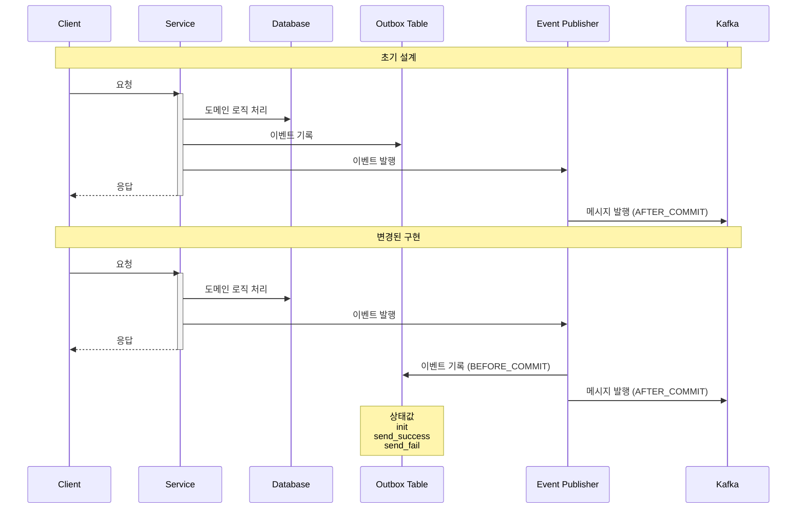
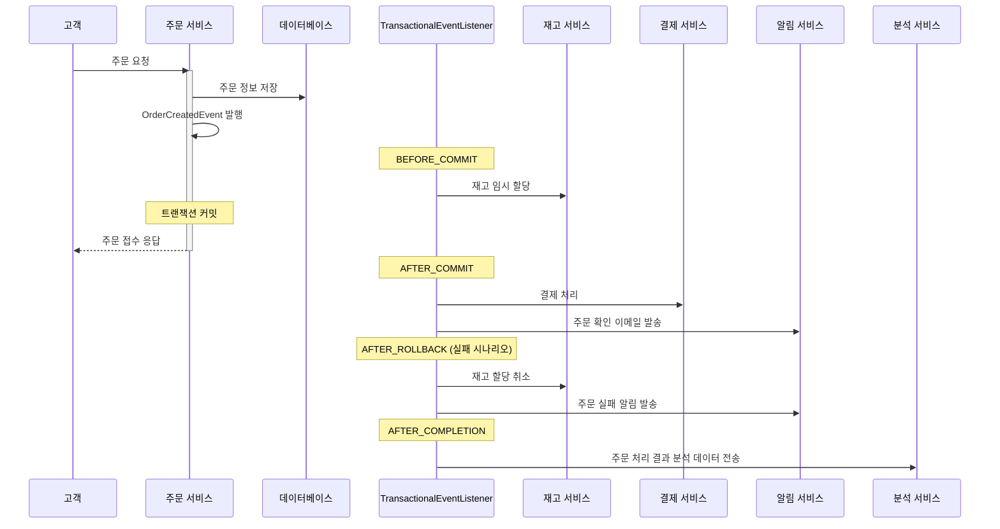

## 「29CM」 트랜잭셔널 아웃박스 패턴의 실제 구현 사례
> 📅 탐구 일자: 2024-10-25

### 🔗 분석한 블로그 포스트
- 제목: "트랜잭셔널 아웃박스 패턴의 실제 구현 사례 (29CM)"
- 링크: https://medium.com/@greg.shiny82/트랜잭셔널-아웃박스-패턴의-실제-구현-사례-29cm-0f822fc23edb
- 작성자: Greg Lee

### 🏷️ 주요 키워드
- 트랜잭션 관리, 이벤트 발행

### 📚 핵심 내용 요약
- 트랜잭셔널 메시징 유형인 `트랜잭셔널 아웃박스 패턴` 적용 소개 및 EDA

### 💡 주요 기술적 인사이트
1. `TransactionalEventListener` 이용해 트랜잭션 결과에 따라 이벤트 처리 제어
2. 이벤트 발행 정보 별도의 `outbox` 테이블 관리

### 🛠️ 실제 적용 사례 또는 구현 방법
#### 트랜잭셔널 메시징 개요


- 트랜잭션과 같이 하나의 메시지 흐름으로 기억하면 된다.

#### 트랜잭셔널 메시징 개념


- 트랜잭셔널 메시징: 서비스 로직 실행 + 이후의 이벤트 함께 실행하는 것
- 트랜잭셔널 메시징은 크게 2가지로 나뉜다
    - 트랜잭셔널 아웃박스 패턴 (여기서 다룰 개념 🐶)
    - 변경 데이터 캡쳐
 
#### 왜 트랜잭션 메시징을 도입했을까
##### 마이크로 서비스로 전환하면서 `서버간 데이터 정합성 필요 + 복잡한 요구사항`


#### EDA 초기 설계는?


- 비즈니스 모든 로직을 하나의 트랜잭션으로 묶어서 개발
#### 하지만, 비즈니스 로직 실행 중 중간 에러가 발생하게 되면? 메시지 큐 미발행 등 이슈 발생 💦
##### `트랜잭션 메시징` :: 트랜잭셔널 아웃박스 패턴 도입


##### 트랜잭셔널 아웃박스 적용된 시스템 구조


#### 비즈니스 로직은 어떻게 바뀌게 되었을까?


##### 🔥`TransactionalEventListener의 BEFORE_COMMIT 활용하다`
###### ✅ 초기 설계
- 하나의 트랜잭션 안에서 도메인 로직 처리
- outbox 이벤트 테이블에 이벤트 기록, 이벤트 발행 수행

###### ✅ 변경된 구현
- 도메인 로직 처리와 이벤트 발행만 트랜잭션 내에서 수행
- `BEFORE_COMMIT` 단계에서 outbox 테이블 이벤트 기록
- `AFTER_COMMIT` 단계에서 카프카 메시지 발행
- 장점은??
    - 이벤트 발행 이후의 모든 로직을 `TransactionalEvenListener` 에서 처리 > 일관성 유지
    - 도메인 로직과 부가적인 처리를 명확히 분리 > 확장성 & 응집도 향상


##### 🔥`메시지 발행 상태 값의 상세화`
###### ✅ 초기 설계
- boolean 타입의 publised 필드 사용 (true/false)
###### ✅ 변경된 구현
- 상태값 크게 3가지로 상세화
    - `init`: 이벤트 발행 등록 (outbox에 처음 기록될 때)
    - `send_success`: 이벤트 발행 성공
    - `send_fail`: 이벤트 발행 실패 (카프카에 메시지 전송 실패)
 
- 상태값으로 나뉘게 되면서
    - 더 상세한 상태 추적 가능
    - 문제 상황 식별 용이 (예. 서비스 배포 시 graceful shutdown 이슈)
    - 추가로, ThreadPoolTaskExecutor 설정 개선으로 graceful shutdown 이슈 해결

##### 다이어그램으로 다시 정리해보자


#### 👨‍🌾 이제는 새롭게 알게된 `TransactionalEventListener` 정리해보자
> 이벤트 처리 메커니즘

##### 트랜잭션 단계와 연동
- `BEFORE_COMMIT`: 트랜잭션 커밋 직전
- `AFTER_COMMIT` : 트랜잭션 커밋 직후
- `AFTER_ROLLBACK` : 트랜잭션 롤백 직후
- `AFTER_COMPLETION` : 트랜잭션 완료 후 (커밋 또는 롤백)

- 트랜잭션 컨텍스트 내에서 안전한 이벤트 처리가 가능
   - 트랜잭션의 결과에 따라 이벤트 처리 제어 가능
- 비동기 처리 가능
   - `@Async` 어노테이션과 함께 사용 > 비동기적으로 이벤트 처리 가능

##### 예시 코드
```kotlin
@Component
public class MyTransactionalEventListener {

    @TransactionalEventListener(phase = TransactionPhase.AFTER_COMMIT)
    public void handleAfterCommit(MyCustomEvent event) {
        // 트랜잭션이 성공적으로 커밋된 후 실행될 로직
        System.out.println("트랜잭션 커밋 후 이벤트 처리: " + event.getMessage());
    }

    @TransactionalEventListener(phase = TransactionPhase.AFTER_ROLLBACK)
    public void handleAfterRollback(MyCustomEvent event) {
        // 트랜잭션이 롤백된 후 실행될 로직
        System.out.println("트랜잭션 롤백 후 이벤트 처리: " + event.getMessage());
    }
}
```


##### 이제는 실제 실무에서 사용 예시를 살펴보자
> 이커머스 서비스



- `BEFORE_COMMIT`
    - 사용 사례: 재고 임시 할당
    - 설명: 주문이 완전히 확정되기 전에 재고를 임시로 할당합니다. 이는 동시에 발생하는 다른 주문과의 충돌을 방지하기 위함입니다.
    - 장점: 트랜잭션이 실제로 커밋되기 전에 중요한 사전 작업을 수행할 수 있습니다.
- `AFTER_COMMIT`
    - 사용 사례: 결제 처리 및 주문 확인 이메일 발송
    - 설명: 주문이 성공적으로 데이터베이스에 저장된 후, 결제를 진행하고 고객에게 주문 확인 이메일을 발송합니다.
    - 장점: 주문 데이터의 일관성이 보장된 후에 외부 시스템과의 상호작용을 수행합니다.
- `AFTER_ROLLBACK`
    - 사용 사례: 재고 할당 취소 및 주문 실패 알림 발송
    - 설명: 주문 처리 중 오류가 발생하여 트랜잭션이 롤백된 경우, 임시 할당된 재고를 취소하고 고객에게 주문 실패 알림을 발송합니다.
    - 장점: 실패한 트랜잭션에 대한 정리 작업과 사용자 통지를 안전하게 수행할 수 있습니다.
- `AFTER_COMPLETION`
    - 사용 사례: 주문 처리 결과 분석 데이터 전송
    - 설명: 주문 처리가 완료된 후(성공 또는 실패), 전체 과정에 대한 분석 데이터를 별도의 분석 시스템으로 전송합니다.
    - 장점: 트랜잭션의 최종 결과에 상관없이 항상 실행되어야 하는 작업을 처리할 수 있습니다.
- 👨‍🌾 `전체적인 장점`
    1. `세분화된 제어`: 트랜잭션의 각 단계에 맞는 적절한 작업을 수행할 수 있습니다.
    2. `안정성 향상`: 주문 처리의 각 단계에서 발생할 수 있는 문제에 대해 더 세밀하게 대응할 수 있습니다.
    3. `성능 최적화`: 주 트랜잭션에 영향을 주지 않고 부가적인 작업들을 비동기적으로 처리할 수 있습니다.
    4. `확장성`: 새로운 요구사항이 생길 때 기존 코드를 수정하지 않고 적절한 단계의 리스너를 추가하여 대응할 수 있습니다.

##### 이제는 실제 실무에서 사용 예시를 살펴보자 (코드단)
> 이커머스 서비스

```java
✅ 도메인 서비스 클래스
@Service
@RequiredArgsConstructor
public class InventoryService {
    private final InventoryRepository inventoryRepository;
    private final ApplicationEventPublisher eventPublisher;

    @Transactional
    public void updateInventoryQuantity(UpdateInventoryCommand command) {
        // 1. 도메인 로직 처리
        Inventory inventory = inventoryRepository.findById(command.getInventoryId())
            .orElseThrow(() -> new EntityNotFoundException("Inventory not found"));
        inventory.updateQuantity(command.getNewQuantity());
        inventoryRepository.save(inventory);

        // 2. 이벤트 발행
        eventPublisher.publishEvent(new InventoryUpdatedEvent(this, inventory));
    }
}

✅ 이벤트 클래스
@Getter
public class InventoryUpdatedEvent extends ApplicationEvent {
    private final Inventory inventory;

    public InventoryUpdatedEvent(Object source, Inventory inventory) {
        super(source);
        this.inventory = inventory;
    }
}

✅ Outbox 엔티티
@Entity
@Table(name = "outbox")
@Getter @Setter
public class OutboxEvent {
    @Id
    @GeneratedValue(strategy = GenerationType.IDENTITY)
    private Long id;

    @Enumerated(EnumType.STRING)
    private EventStatus status;

    @Column(columnDefinition = "TEXT")
    private String payload;

    private LocalDateTime createdAt;

    public enum EventStatus {
        INIT, SEND_SUCCESS, SEND_FAIL
    }
}

✅ 이벤트 리스터 클래스
@Component
@RequiredArgsConstructor
public class InventoryEventListener {
    private final OutboxRepository outboxRepository;
    private final KafkaTemplate<String, String> kafkaTemplate;

    @TransactionalEventListener(phase = TransactionPhase.BEFORE_COMMIT)
    public void handleInventoryUpdatedEventBeforeCommit(InventoryUpdatedEvent event) {
        OutboxEvent outboxEvent = new OutboxEvent();
        outboxEvent.setStatus(OutboxEvent.EventStatus.INIT);
        outboxEvent.setPayload(convertToJson(event));
        outboxEvent.setCreatedAt(LocalDateTime.now());
        outboxRepository.save(outboxEvent);
    }

    @TransactionalEventListener(phase = TransactionPhase.AFTER_COMMIT)
    @Async
    public void handleInventoryUpdatedEventAfterCommit(InventoryUpdatedEvent event) {
        OutboxEvent outboxEvent = outboxRepository.findLatestByPayloadContaining(event.getInventory().getId().toString())
            .orElseThrow(() -> new RuntimeException("Outbox event not found"));

        try {
            kafkaTemplate.send("inventory-topic", convertToJson(event));
            outboxEvent.setStatus(OutboxEvent.EventStatus.SEND_SUCCESS);
        } catch (Exception e) {
            outboxEvent.setStatus(OutboxEvent.EventStatus.SEND_FAIL);
        }
        
        outboxRepository.save(outboxEvent);
    }

    private String convertToJson(Object object) {
        // Object를 JSON 문자열로 변환하는 로직
    }
}
```


### 🤔 개인적인 견해 및 분석
- 현재 개발 시에는 단순 트랜잭션만을 묶어서 사용했지만 새롭게 배운 TransactionalEventListener 사용해 복잡한 요구사항 과 이슈를 처리 할 수 있을 거 같다.
- 복잡한 트랜잭션의 처리에는 도메인 지식이 상당 부분 중요할 거 같다. (처리 방법에는 정답이 없기에)

### 🏆 핵심 takeaways 
1. 트랜잭셔널 메시징 기법을 이용해 트랜잭션을 관리한다.
2. 다양한 이벤트 처리 메커니즘을 통해 복잡한 요구 사항을 처리한다.

### 💬 추가 의견 / 질문
- 트랜잭션 메시징 (아웃박스 패턴) 이외 다른 방법론이 있을까?
