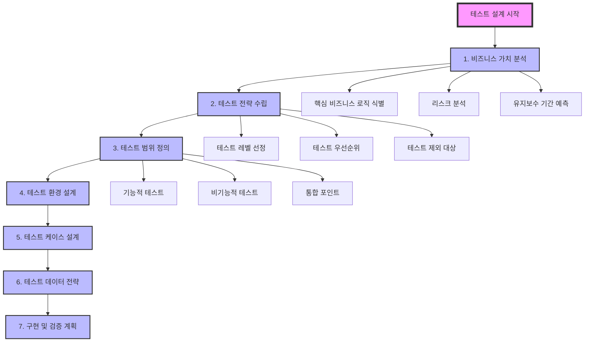

## 「토스」 가치있는 테스트를 위한 전략과 구현
> 📅 탐구 일자: 2024-10-28

### 🔗 분석한 블로그 포스트
- 제목: "가치있는 테스트를 위한 전략과 구현"
- 링크: https://toss.tech/article/test-strategy-server
- 작성자: 조민규 · 토스 Server Developer

### 🏷️ 주요 키워드
- 테스트 전략, FIRST 원칙, 가치 있는 테스트, 선택적 테스트 작성, 실용적 테스트, 도메인 정책 테스트, 단위 테스트

### 📚 핵심 내용 요약
> [!TIP]
> 비즈니스적으로 가치 있는 테스트 코드를 작성하자!

1. 테스트 이상과 현실
    - 작성해야 할 테스트의 양이 많음
    - 구현에 강결합되어 깨지기 쉬움  
    - 테스트 코드 자체가 이해하기 어려움
    - 테스트 실행이 느리고 간헐적으로 실패함
2. 좋은 테스트의 특성
    - FIRST 원칙을 따름 (Fast, Independent, Repeatable, Self-Validating, Timely)
    - 완전성과 간결성을 갖춤
    - 비즈니스적으로 가치 있는 테스트여야 함
3. 토스의 테스트 전략
    1. 작성 가치를 고려하여 선택적으로 작성
    2. 최대한 실용적으로 작성 
    3. 확실한 목적에 따라 작성
4. 도메인 정책 테스트 작성법
    - 단위 테스트로 작성
    - 불필요한 구성 없이 간결하게 작성
    - 경계값을 중심으로 테스트

### 💡 주요 기술적 인사이트
- 테스트 시 필요한 적절한 오픈소스 라이브러리 사용
    - `도메인 정책 테스트 코드 작성`: test-fixtures 라이브러리
    - `승인 테스트`: ApprovalTests.Java 라이브러리
 
### 🛠️ 실제 적용 사례 또는 구현 방법
#### 가치 있는 테스트란?
> 이상적인 테스트 프로세스


#### 하지만 ... 테스트는 현실과 다르다


#### 그래서! 가치있는 테스트 코드!


#### 전체적으로 토스 개발자가 말하고 싶은 부분을 보자!


- 위에 볼듯 있듯 상황에 따라 유연하게 테스트 전략을 취하고 있다
    - 예를 들어, 통합 테스트에서는 외부, 내부 서비스 별 사용하는 객체가 다르다. 추가적인 부가 기능 테스트 진행하기.
 
#### 한계점도 있다고 한다


#### 😏 이제는 위 내용을 토대로 테스트 코드에 더 알아보자
##### 먼저 테스트 아키텍처 구조는 어떻게 구성되어 있는지부터 살펴보자 
> [!IMPORTANT]
> 비즈니스 가치를 중요시하는 테스트 전략 취하기! (모든 것을 테스트하지 말자)


##### 정리하자면
1. 계층별 테스트 전략
    - 단위 테스트: 도메인 로직과 비즈니스 정책에 집중
    - 통합 테스트: 외부 의존성과의 상호작용 검증
    - E2E 테스트: 전체 시스템 흐름 검증
2. FIRST 원칙 준수
    - Fast: 단위 테스트는 빠르게 실행
    - Independent: 각 테스트는 독립적으로 실행 가능
    - Repeatable: 동일한 결과를 보장
    - Self-Validating: 자동화된 검증
    - Timely: 실제 코드 작성과 함께 테스트 작성
3. 실용적 접근
    - 모든 것을 테스트하지 않고 중요 비즈니스 로직에 집중
    - 경계값 테스트 케이스 우선 작성
    - 테스트 가독성을 위한 명확한 given-when-then 구조
4. 테스트 환경 설정
    - @SpringBootTest: 필요한 경우에만 전체 컨텍스트 로드
    - @Transactional: 테스트 격리성 보장
    - TestRestTemplate: E2E 테스트용 클라이언트

#### 코드로 한번 살펴보자
```kotlin
// 도메인 모델
data class Account(
    val id: Long,
    val balance: BigDecimal,
    val status: AccountStatus
) {
    fun withdraw(amount: BigDecimal): Result<Account> {
        return when {
            status != AccountStatus.ACTIVE -> Result.failure(IllegalStateException("계좌가 활성 상태가 아닙니다"))
            balance < amount -> Result.failure(IllegalStateException("잔액이 부족합니다"))
            else -> Result.success(copy(balance = balance - amount))
        }
    }
}

enum class AccountStatus {
    ACTIVE, SUSPENDED, CLOSED
}

// 1. 단위 테스트 예시 (도메인 정책 테스트)
@DisplayName("계좌 출금 정책 테스트")
class AccountTest {
    @Test
    fun `활성 계좌에서 잔액 이하 금액 출금 시 성공`() {
        // given
        val account = Account(1L, BigDecimal("10000"), AccountStatus.ACTIVE)
        
        // when
        val result = account.withdraw(BigDecimal("5000"))
        
        // then
        assertThat(result.isSuccess).isTrue
        assertThat(result.getOrNull()?.balance).isEqualTo(BigDecimal("5000"))
    }
    
    @Test
    fun `잔액보다 큰 금액 출금 시 실패`() {
        // given
        val account = Account(1L, BigDecimal("1000"), AccountStatus.ACTIVE)
        
        // when
        val result = account.withdraw(BigDecimal("2000"))
        
        // then
        assertThat(result.isFailure).isTrue
        assertThat(result.exceptionOrNull()?.message).contains("잔액이 부족합니다")
    }
}

// 2. 통합 테스트 예시 (레포지토리 테스트)
@SpringBootTest
class AccountRepositoryTest {
    @Autowired
    private lateinit var accountRepository: AccountRepository
    
    @Test
    @Transactional
    fun `계좌 저장 및 조회 테스트`() {
        // given
        val account = Account(null, BigDecimal("10000"), AccountStatus.ACTIVE)
        
        // when
        val savedAccount = accountRepository.save(account)
        val foundAccount = accountRepository.findById(savedAccount.id)
        
        // then
        assertThat(foundAccount).isPresent
        assertThat(foundAccount.get().balance).isEqualTo(BigDecimal("10000"))
    }
}

// 3. E2E 테스트 예시 (API 엔드포인트 테스트)
@SpringBootTest(webEnvironment = SpringBootTest.WebEnvironment.RANDOM_PORT)
class AccountApiTest {
    @Autowired
    private lateinit var testRestTemplate: TestRestTemplate
    
    @Test
    fun `계좌 출금 API 테스트`() {
        // given
        val request = WithdrawRequest(BigDecimal("5000"))
        
        // when
        val response = testRestTemplate.postForEntity(
            "/api/accounts/1/withdraw",
            request,
            WithdrawResponse::class.java
        )
        
        // then
        assertThat(response.statusCode).isEqualTo(HttpStatus.OK)
        assertThat(response.body?.balance).isEqualTo(BigDecimal("5000"))
    }
}
```

#### 그렇다면 테스트 전략은 어떤게 있을까
##### `1. 테스트 데이터 관리 전략`
- JSON 기반 테스트 데이터 관리로 가독성과 유지보수성 향상
- 테스트 격리를 위한 @Profile 활용
- TestExecutionListener를 통한 데이터 초기화/정리 자동화

##### `2. 테슽 환경 최적화`
```kotlin
@TestConfiguration
class TestConfig {
    @Bean
    fun lazyInitializationExcludeFilter(): LazyInitializationExcludeFilter {
        return LazyInitializationExcludeFilter.forBeanTypes(
            // 즉시 초기화가 필요한 빈들
            ExternalSystemClient::class.java,
            CacheManager::class.java
        )
    }
}
```

##### `3. 실용적인 테스트 전략`
- 비즈니스 핵심 로직에 집중
- 짧은 수명의 이벤트성 기능은 테스트 생략 가능
- 복잡한 시나리오는 통합테스트로 커버

##### `4. 테스트 대역 사용 기준`
```kotlin
// 외부 시스템 Fake 구현 예시
@Profile("test")
@Component
class TestPaymentGateway : PaymentGateway {
    override fun processPayment(request: PaymentRequest): PaymentResult {
        return when {
            request.amount > 1_000_000 -> PaymentResult.LIMIT_EXCEEDED
            request.userId == -1L -> PaymentResult.USER_BLOCKED
            else -> PaymentResult.SUCCESS
        }
    }
}
```

##### `5. 캐시 호환성 테스트`
```kotlin
class CacheCompatibilityTest {
    @Test
    fun `캐시 직렬화 호환성 검증`() {
        // given
        val key = "user:1234"
        val value = UserProfile(id = 1234, name = "홍길동")
        
        // when
        cacheManager.getCache("userProfile").put(key, value)
        val cached = cacheManager.getCache("userProfile").get(key, UserProfile::class.java)
        
        // then
        assertThat(cached).isEqualTo(value)
    }
}
```


- 테스트 간 컨텍스트 공유로 성능 최적화
- @DirtiesContext 최소화
- 테스트 격리를 위한 트랜잭션 관리

##### `6. 문서화와 테스트 결합`
```kotlin
@Test
fun `입금 한도 초과시 실패 - API 문서화`() {
    // given
    val request = TransferRequest(amount = 1_000_001)
    
    // when
    val response = mockMvc.perform(post("/api/transfer")
        .content(objectMapper.writeValueAsString(request)))
        .andDo(document("transfer-limit-exceeded")) // Spring REST Docs 활용
        
    // then
    response.andExpect(status().isBadRequest)
}
```

##### `7. 테스트 가독성 향상`
- given/when/then 패턴 일관적 사용
- 도메인 용어를 활용한 테스트 네이밍
- 테스트 유틸리티 클래스 활용

#### 이러한 테스트를 개발하기전 설계를 해야되는지 알아보자
> 테스트 설계 프로세스




##### 🚀 테스트 설계 템플릿


<details>
<summary>펼쳐보기</summary>
  
# 1. 비즈니스 가치 분석
## 1.1 핵심 기능 식별
- [ ] 비즈니스 크리티컬한 기능 리스트업
- [ ] 실패 시 영향도 분석
- [ ] 사용 빈도 분석

## 1.2 리스크 분석
- [ ] 데이터 정합성 리스크
- [ ] 성능 리스크
- [ ] 보안 리스크
- [ ] 확장성 리스크

## 1.3 유지보수 분석
- [ ] 예상 유지보수 기간
- [ ] 변경 가능성이 높은 부분
- [ ] 레거시 마이그레이션 계획

# 2. 테스트 전략 수립
## 2.1 테스트 레벨 결정
- [ ] 단위 테스트 범위
- [ ] 통합 테스트 범위
- [ ] E2E 테스트 범위
- [ ] 성능 테스트 필요성

## 2.2 테스트 우선순위
- Priority 1: 핵심 비즈니스 로직
- Priority 2: 주요 통합 포인트
- Priority 3: 부가 기능
- Priority 4: 예외 케이스

## 2.3 테스트 제외 대상
- [ ] 단기 이벤트성 기능
- [ ] 단순 CRUD
- [ ] 로깅/모니터링
- [ ] UI 레이아웃

# 3. 테스트 환경 설계
## 3.1 테스트 인프라
```kotlin
@TestConfiguration
class TestInfraConfig {
    @Bean
    fun testDatabaseConfig(): DataSource {
        return EmbeddedDatabaseBuilder()
            .setType(EmbeddedDatabaseType.H2)
            .build()
    }
    
    @Bean
    fun testCacheConfig(): CacheManager {
        return ConcurrentMapCacheManager()
    }
}
```

## 3.2 테스트 데이터 전략
```kotlin
@Configuration
class TestDataConfig {
    @Bean
    fun testDataLoader(): TestDataLoader {
        return JsonTestDataLoader(
            baseDir = "test/resources/datasets",
            cleanupStrategy = CleanupStrategy.AFTER_EACH_TEST
        )
    }
}
```

# 4. 테스트 케이스 설계
## 4.1 도메인 정책 테스트
```kotlin
class AccountPolicyTest {
    @Test
    fun `출금 한도 초과 테스트`() {
        // given
        val account = Account(
            balance = 10_000.toBigDecimal(),
            withdrawalLimit = 5_000.toBigDecimal()
        )
        
        // when
        val result = account.withdraw(6_000.toBigDecimal())
        
        // then
        assertThat(result.isFailure).isTrue()
        assertThat(result.exceptionOrNull())
            .isInstanceOf(WithdrawalLimitExceededException::class.java)
    }
}
```

## 4.2 통합 테스트
```kotlin
@AcceptanceTest
class AccountTransferTest {
    @Test
    fun `계좌 이체 성공 시나리오`() {
        // given
        val sender = createAccount("sender", 10_000)
        val receiver = createAccount("receiver", 0)
        
        // when
        val result = transferService.transfer(
            fromAccount = sender.id,
            toAccount = receiver.id,
            amount = 5_000.toBigDecimal()
        )
        
        // then
        assertThat(result.isSuccess).isTrue()
        assertThat(accountRepository.findById(sender.id).balance)
            .isEqualTo(5_000.toBigDecimal())
        assertThat(accountRepository.findById(receiver.id).balance)
            .isEqualTo(5_000.toBigDecimal())
    }
}
```

# 5. 구현 및 검증 계획
## 5.1 테스트 실행 전략
- CI/CD 파이프라인 통합
- 테스트 실행 순서
- 테스트 타임아웃 설정
- 실패 시 재시도 전략

## 5.2 모니터링 및 유지보수
- 테스트 커버리지 목표
- 테스트 실행 시간 모니터링
- 깨진 테스트 관리 전략
- 테스트 코드 리뷰 프로세스
</details>


#### 마지막으로 테스트 핵심 포인트를 살펴보자 🔥
##### 1. 테스트 코드 구조화
```
project
├── src
│   ├── main
│   └── test
│       ├── unit
│       │   ├── domain
│       │   └── service
│       ├── integration
│       │   ├── api
│       │   └── repository
│       ├── acceptance
│       ├── resources
│       │   ├── datasets
│       │   └── application-test.yml
│       └── support
```

##### 2. 공통 테스트 지원 클래스
```kotlin
abstract class BaseTest {
    protected val objectMapper = ObjectMapper()
    protected val testDataLoader = TestDataLoader()
    
    @BeforeEach
    fun setUp() {
        testDataLoader.load()
    }
    
    @AfterEach
    fun tearDown() {
        testDataLoader.cleanup()
    }
}
```

##### 3. 테스트 데이터 관리
```kotlin
interface TestDataSet {
    fun load(): Map<String, List<Any>>
    fun cleanup()
}

class JsonTestDataSet(
    private val file: String
) : TestDataSet {
    override fun load(): Map<String, List<Any>> {
        return objectMapper.readValue(
            ClassPathResource(file).inputStream,
            object : TypeReference<Map<String, List<Any>>>() {}
        )
    }
}
```

##### 4. 테스트 유틸리티
```kotlin
object TestUtils {
    fun createTestAccount(
        balance: BigDecimal = BigDecimal.ZERO,
        status: AccountStatus = AccountStatus.ACTIVE
    ): Account {
        return Account(
            id = UUID.randomUUID(),
            balance = balance,
            status = status
        )
    }
}
```
#### 테스트 구조 = 건물


- ✅ 건물의 기초 (Base Test Infrastructure)
    - 모든 테스트의 기반이 되는 공통 설정과 구성
    - TestConfiguration, BaseTest 클래스 등
- ✅ 세 개의 기둥 (Test Types)
    - Unit Tests: 개별 컴포넌트 테스트
    - Integration Tests: 컴포넌트 간 상호작용 테스트
    - E2E Tests: 전체 시스템 흐름 테스트
- ✅ 창문들 (Test Cases)
    - 각 테스트 타입별 구체적인 테스트 케이스들
    - 체계적으로 구성된 테스트 메소드들
- ✅ 지붕 (Test Architecture)
    - 전체 테스트 구조를 보호하고 통합하는 아키텍처
    - 테스트 전략과 정책
- ✅ 저장소 (Test Data Storage)
    - JSON 기반의 테스트 데이터 관리
    - 테스트 리소스 파일들
- ✅ 도구상자 (Test Utils)
    - 테스트 지원 유틸리티
    - 헬퍼 클래스들
    - 픽스처 관리 도구
 
##### 이러한 구조는!
- 명확한 책임 분리
- 재사용성 증가
- 유지보수 용이성
- 확장 가능성
- 테스트 격리

### 🤔 개인적인 견해 및 분석
- 현재 개발 시 테스트 코드에 대해 많이 미흡한 거 같다. 이 이론을 참고해서 비즈니스(도메인) 가치를 중요시 하는 테스트를 작성해야겠다.
- 성공적인 소프트웨어 개발를 위해서는 `도메인 (비즈니스) 가치` 중요하다는 점을 다시 한번 상기했다.
- 테스트 작성에는 정답이 없고 상황에 따라 유연하게 전략을 취해야 된다.

### 🏆 핵심 takeaways 
1. 비즈니스 가치를 중요시하는 테스트 코드 작성
2. 상황에 따라 유연한 전략

### 💬 추가 의견 / 질문
- 자바, 코틀린 진영에서 주로 사용하는 테스트 관련 라이브러리는?
- MSA 환경에서의 테스트 전략은?
- 금융권과 같이 차단된 회사 내부망에서 가능한 테스트 전략은?
