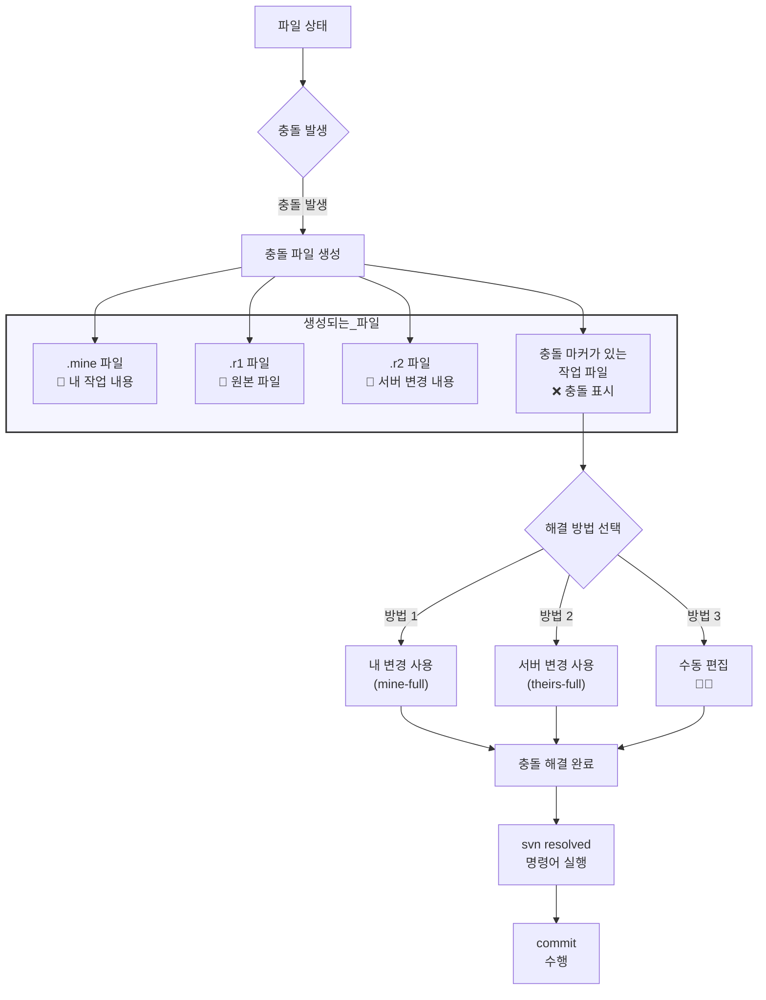

## SVN 병합 충돌은 어떻게 해결할까
> 작성날짜: 25.02.23

### 상황



- update 시 로컬 변경사항과 서버의 변경사항이 충돌
- 동일 파일의 동일 부분을 여러 사용자가 수정했을 때 발생
- commit 시도 시 충돌이 발생하면 commit이 거부됨


#### 충돌 시 생성되는 파일들
```
예시: example.txt 파일에 충돌이 발생한 경우
- example.txt.mine : 내가 수정한 버전
- example.txt.r1234 : 원본 파일 (베이스 리비전)
- example.txt.r1235 : 서버에서 변경된 버전
- example.txt : 충돌 마커가 포함된 작업 파일
```

##### 실제 파일 모습


#### 충돌 마커 형태
```
<<<<<<< .mine
내가 수정한 내용
=======
서버에서 변경된 내용
>>>>>>> .r1235
```

#### 충돌 해결 방법 (3)
##### 1. 명령어를 통한 해결
```
# 내 변경사항 사용
svn resolve --accept mine-full example.txt

# 서버 변경사항 사용
svn resolve --accept theirs-full example.txt

# 작업 복사본 변경사항 사용
svn resolve --accept working example.txt
```

##### 2. 수동 해결 절차 
1. 충돌 파일 열기
2. 충돌 마커 찾기
3. 코드 수정
4. 충돌 마커 제거
5. 해결 표시: svn resolved example.txt
6. 변경사항 커밋

##### 3. TortoiseSVN을 사용한 해결 (Windows)
1. 충돌 파일 우클릭
2. TortoiseSVN → Edit Conflicts 선택
3. 그래픽 도구로 충돌 해결
4. 해결 완료 후 Mark as Resolved 클릭


### 👨‍🌾 충돌 예방 팁
1. 작업 전 항상 `update` 수행
  - svn update
2. 자주 `commit` 하기
  - 작은 단위로 자주 커밋하면 충돌 가능성 감소
3. 파일 잠금 사용

```
# 작업 복사본 상태 확인
svn status

# 충돌 파일 확인
svn status | grep "^C"
```

4. 상태 확인

```
# 작업 복사본 상태 확인
svn status

# 충돌 파일 확인
svn status | grep "^C"
```


### 주의 사항
```
충돌 해결 전에 반드시 백업
해결 후 테스트 필수
불확실할 경우 팀원과 상의
binary 파일 충돌은 수동 병합 불가능
```


