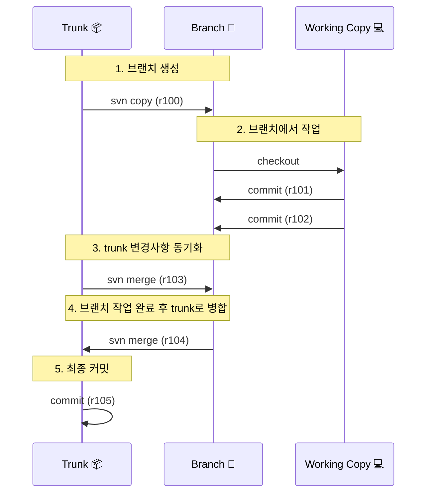

## SVN 병합 프로세스
> 작성날짜: 25.02.23

### 요약


### 크게 2가지 시나리오 발생
- SVN의 병합은 중앙집중식 특성 때문에 Git보다 더 신중하게 접근해야 하는 경향

#### 1. 브랜치 작업 중 Trunk의 변경사항 가져오기
```
# 브랜치 작업 디렉토리에서
svn merge ^/trunk
svn commit -m "trunk의 변경사항 병합"
```

#### 2. 브랜치 작업 완료 후 Trunk로 병합
```
# trunk 작업 디렉토리에서
svn merge ^/branches/feature-branch
svn commit -m "feature-branch 병합 완료"
```

### 주요 병합 유형 (3)
#### 1. 리비전 범위 병합
```
# 특정 리비전 범위 병합
svn merge -r100:200 ^/branches/feature-branch
```

#### 2. 재통합 병합 (Reintegrate)
```
# 브랜치의 모든 변경사항을 trunk로 병합
svn merge --reintegrate ^/branches/feature-branch
```

#### 3. 체리픽 병합 (Cherry-picking)
```
# 특정 리비전만 선택적으로 병합
svn merge -c 145 ^/branches/feature-branch
```


---
### `TortoiseSVN` 병합 과정


```
작업 폴더 우클릭
TortoiseSVN → Merge 선택
병합 마법사 실행됨
```

#### 1. 병합 유형 선택 
##### Merge a range of revisions
```
가장 일반적인 병합 방식
특정 리비전 범위의 변경사항 병합
```

##### Reintegrate a branch
```
브랜치 작업 완료 후 trunk로 병합할 때 사용
브랜치의 모든 변경사항을 한 번에 병합
```

##### Merge two different trees
```
서로 다른 두 경로의 차이를 병합
특정 시점 비교 병합 시 사용
```

#### 2. 상세 병합 절차
##### 2.1 브랜치에서 Trunk로 병합
1. Trunk 작업 복사본으로 이동
2.  우클릭 → TortoiseSVN → Merge
3. 'Merge a range of revisions' 선택
4. 브랜치 URL 입력
5. 병합할 리비전 범위 선택
6. Test Merge로 미리 확인
7. 실제 병합 실행

##### 2.2 Trunk에서 브랜치로 병합
1. 브랜치 작업 복사본으로 이동
2. 우클릭 → TortoiseSVN → Merge
3. 'Merge a range of revisions' 선택
4. Trunk URL 입력
5. 병합할 리비전 선택
6. Test Merge로 확인
7. 병합 실행


