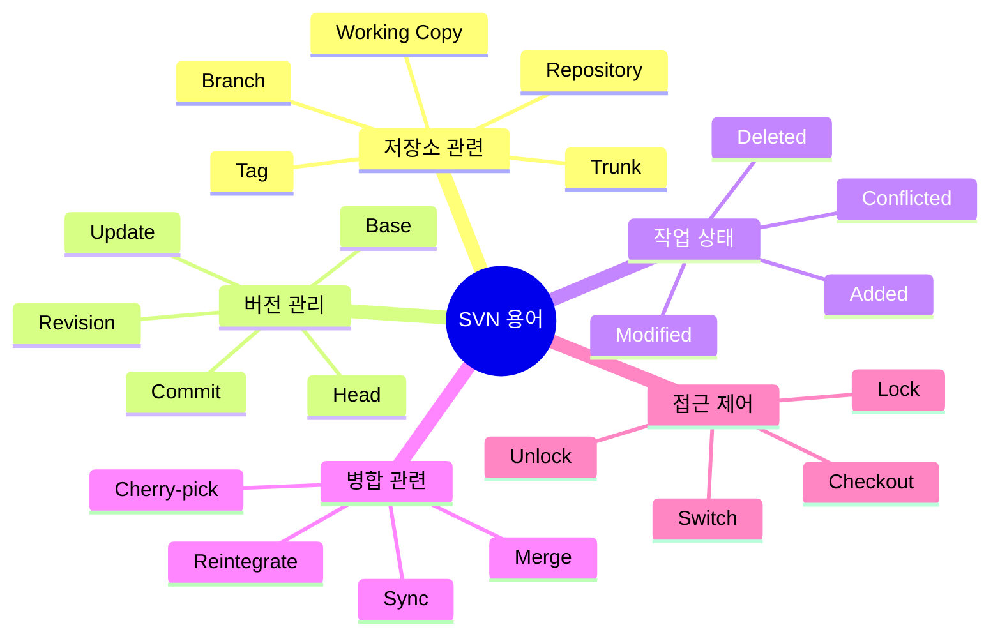

### SVN 주요 용어 설명

### 1. 저장소 관련 용어

#### Repository (저장소)
- 모든 프로젝트 파일과 변경 이력을 저장하는 중앙 데이터베이스
- 서버에 위치하며 모든 버전 정보 보관

#### Working Copy (작업 복사본)
- 로컬에서 작업하는 파일들의 복사본
- Repository의 특정 버전을 로컬에 체크아웃한 상태

#### Trunk (트렁크)
- 프로젝트의 메인 개발 라인
- 안정적인 코드가 유지되는 주요 브랜치

#### Branch (브랜치)
- 독립적인 개발을 위해 분기된 개발 라인
- 새로운 기능 개발이나 버그 수정에 사용

#### Tag (태그)
- 특정 시점의 스냅샷
- 주로 릴리스 버전을 표시하는데 사용

### 2. 버전 관리 용어

#### Revision (리비전)
- 저장소의 특정 시점 상태
- 커밋할 때마다 순차적으로 증가하는 번호

#### Head
- 저장소의 최신 리비전
- 가장 최근에 커밋된 상태

#### Base
- 작업 복사본이 기반으로 하는 리비전
- 마지막으로 업데이트 받은 상태

#### Commit (커밋)
- 로컬 변경사항을 저장소에 반영
- 새로운 리비전 생성

#### Update (업데이트)
- 저장소의 변경사항을 작업 복사본에 반영
- HEAD 리비전과 동기화

### 3. 작업 상태 용어

#### Modified (수정됨)
- 로컬에서 파일이 변경된 상태
- 아직 커밋되지 않은 변경사항

#### Added (추가됨)
- 저장소에 새로 추가될 파일
- svn add 명령으로 추가된 상태

#### Deleted (삭제됨)
- 저장소에서 삭제될 파일
- svn delete 명령으로 표시된 상태

#### Conflicted (충돌)
- 다른 변경사항과 충돌이 발생한 상태
- 수동 해결이 필요한 상태

### 4. 병합 관련 용어

#### Merge (병합)
- 서로 다른 브랜치의 변경사항을 통합
- 충돌이 발생할 수 있는 작업

#### Reintegrate (재통합)
- 브랜치의 모든 변경사항을 trunk로 병합
- 브랜치 작업 완료 시 사용

#### Cherry-pick (체리픽)
- 특정 리비전만 선택적으로 병합
- 필요한 변경사항만 가져올 때 사용

#### Sync (동기화)
- 브랜치를 상위 브랜치와 동기화
- 최신 변경사항 반영

### 5. 접근 제어 용어

#### Lock (잠금)
- 파일을 독점적으로 수정하기 위해 잠금
- 다른 사용자의 수정 방지

#### Unlock (잠금 해제)
- 잠긴 파일을 해제
- 다른 사용자가 수정 가능하도록 함

#### Switch (전환)
- 작업 복사본의 URL을 변경
- 다른 브랜치로 전환할 때 사용

#### Checkout (체크아웃)
- 저장소에서 작업 복사본 생성
- 로컬에서 작업 시작할 때 수행
