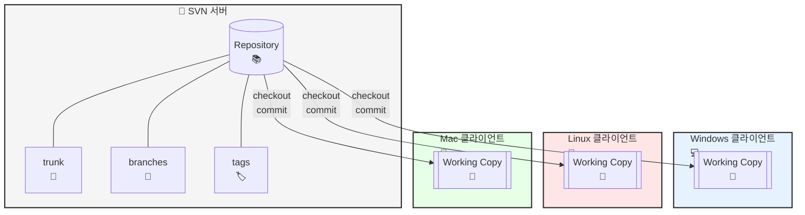

## SVN에 대해 알아보자
> 작성날짜: 25.02.23

### SVN 이란?
> 보통 회사 내 보안 이슈로 Git 사용 불가한 상황?

- 아파치 서브버전 (`Subversion`) > 프로젝트 버전 관리를 위해 사용하는 형상관리 툴
- 또 다른 형상관리 툴인 `CVS` 의 한계점 극복위해 개발
- SVN은 `클라이언트 서버 모델` 을 따르도록 구현


### 대략적인 예시 구조


#### 1. 서버 구조
- Repository: 모든 프로젝트 데이터와 이력이 저장되는 중앙 저장소
- trunk: 주요 개발 줄기로, 실제 제품에 반영될 코드가 저장됨
- branches: 새로운 기능 개발이나 버그 수정을 위한 분기 코드 저장
- tags: 릴리스 버전 등 특정 시점의 코드 스냅샷을 저장

#### 2. 클라이언트 구조
##### Windows
```
TortoiseSVN이 가장 널리 사용됨
GUI 기반으로 직관적인 조작 가능
Windows 탐색기와 통합되어 사용 편리
```

##### Linux
```
커맨드 라인 기반 svn 클라이언트 사용
RapidSVN 등 GUI 도구도 사용 가능
서버 구축이 용이하며 주로 서버 용도로 사용
```

##### Mac
```
Versions, Cornerstone 등 GUI 클라이언트 사용
터미널에서 커맨드 라인 도구로도 사용 가능
```

### 🚨 SVN은 `중앙집중식 버전관리 시스템` !!


- 이 방식은 각각의 개발자들이 본인의 코드 변경 사항을 하나의 중앙 `repository`에 `commit` 하는 방식


