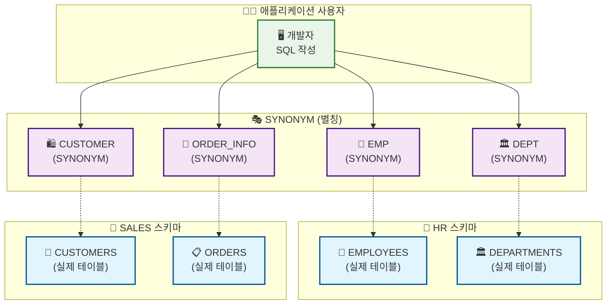
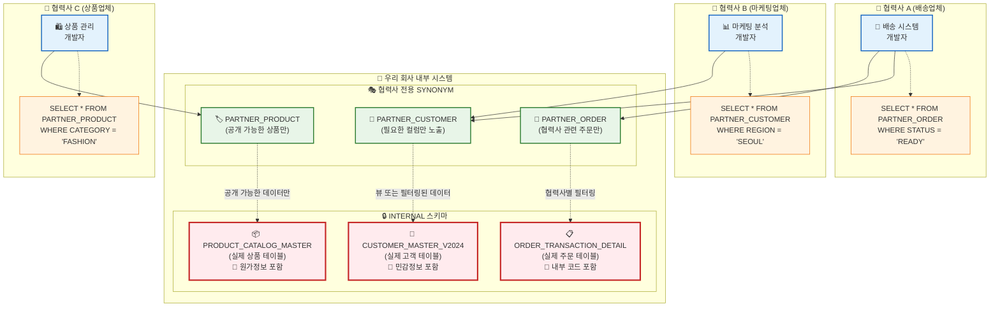

## 오라클 SYNONYM이란?
> 작성날짜: 25.07.19

- SYNONYM은 데이터베이스 객체(테이블, 뷰, 시퀀스, 프로시저 등)에 대한 별칭입니다. 실제 객체명 대신 사용할 수 있는 대체 이름을 제공

### 주요 특징
- 간편성: 긴 스키마명.객체명을 짧은 이름으로 대체
- 보안성: 실제 객체 위치를 숨길 수 있음
- 유연성: 객체 위치가 변경되어도 SYNONYM만 수정하면 됨
- 호환성: 다른 스키마의 객체를 마치 자신의 객체처럼 사용 가능

### 문법
#### SYNONYM 생성
```sql
-- PUBLIC SYNONYM (모든 사용자가 사용 가능)
CREATE PUBLIC SYNONYM synonym_name FOR schema_name.object_name;

-- PRIVATE SYNONYM (생성한 사용자만 사용 가능)
CREATE SYNONYM synonym_name FOR schema_name.object_name;
```

#### SYNONYM 삭제
```sql
DROP PUBLIC SYNONYM synonym_name;
DROP SYNONYM synonym_name;
```

#### 예시 
```sql
-- HR 스키마의 EMPLOYEES 테이블에 대한 SYNONYM 생성
CREATE SYNONYM EMP FOR HR.EMPLOYEES;

-- 이제 EMP로 접근 가능
SELECT * FROM EMP;
```




### 사용 시나리오
#### 1. 스키마 간 편리한 접근
```sql
-- 기존 방식 (긴 스키마명 필요)
SELECT * FROM HR.EMPLOYEES WHERE DEPARTMENT_ID = 10;

-- SYNONYM 사용 (간단한 이름으로 접근)
CREATE SYNONYM EMP FOR HR.EMPLOYEES;
SELECT * FROM EMP WHERE DEPARTMENT_ID = 10;
```


#### 2. 데이터베이스 이전 시 유연성
```sql
-- 개발 환경
CREATE SYNONYM CUSTOMER FOR DEV_SCHEMA.CUSTOMERS;

-- 운영 환경으로 이전 시 SYNONYM만 변경
DROP SYNONYM CUSTOMER;
CREATE SYNONYM CUSTOMER FOR PROD_SCHEMA.CUSTOMERS;
-- 애플리케이션 코드는 수정 불필요!
```


#### 3. PUBLIC vs PRIVATE SYNONYM
```sql
-- PUBLIC SYNONYM: 모든 사용자가 사용 가능
CREATE PUBLIC SYNONYM EMP FOR HR.EMPLOYEES;

-- PRIVATE SYNONYM: 생성한 사용자만 사용 가능
CREATE SYNONYM MY_EMP FOR HR.EMPLOYEES;
```

---
### 협력사 제공 시 SYNONYM 활용 이유
#### 1. 보안 강화 🔒
```sql
-- 실제 테이블 구조 숨기기
-- 협력사는 실제 스키마/테이블명을 알 수 없음
CREATE PUBLIC SYNONYM PARTNER_CUSTOMER FOR INTERNAL.CUSTOMER_MASTER_V2024;
CREATE PUBLIC SYNONYM PARTNER_ORDER FOR INTERNAL.ORDER_TRANSACTION_DETAIL;
```

#### 2. 권한 관리 용이성 👥
```sql
-- 협력사 전용 계정 생성
CREATE USER PARTNER_A IDENTIFIED BY password123;

-- SYNONYM에 대한 권한만 부여
GRANT SELECT ON PARTNER_CUSTOMER TO PARTNER_A;
GRANT SELECT ON PARTNER_ORDER TO PARTNER_A;

-- 실제 테이블에는 직접 접근 불가
```

#### 3.  데이터 변경 투명성 🔄
```sql
-- 내부 테이블 구조 변경 시
-- 협력사 코드는 수정 불필요

-- 기존
CREATE SYNONYM PARTNER_CUSTOMER FOR OLD_SCHEMA.CUSTOMER_INFO;

-- 시스템 업그레이드 후
DROP SYNONYM PARTNER_CUSTOMER;
CREATE SYNONYM PARTNER_CUSTOMER FOR NEW_SCHEMA.CUSTOMER_MASTER;
```


#### 연동 예시


#### 협력사 제공 시 단계별 예시
#### 1. 단계별 구현
```sql
-- 1단계: 협력사 전용 뷰 생성 (필요한 컬럼만 노출)
CREATE OR REPLACE VIEW PARTNER_CUSTOMER_VIEW AS
SELECT 
    CUSTOMER_ID,
    CUSTOMER_NAME,
    PHONE,
    EMAIL,
    ADDRESS,
    REGION_CODE
    -- 주민번호, 내부코드 등 민감정보 제외
FROM INTERNAL.CUSTOMER_MASTER_V2024
WHERE STATUS = 'ACTIVE';

-- 2단계: SYNONYM 생성
CREATE PUBLIC SYNONYM PARTNER_CUSTOMER FOR PARTNER_CUSTOMER_VIEW;

-- 3단계: 협력사 계정에 권한 부여
GRANT SELECT ON PARTNER_CUSTOMER TO PARTNER_DELIVERY_COMPANY;
```

#### 2.  협력사별 차별화된 접근
```sql
-- 배송업체용 (주문 정보 중심)
CREATE SYNONYM DELIVERY_ORDERS FOR FILTERED_ORDER_VIEW;

-- 마케팅업체용 (고객 정보 중심, 개인정보 마스킹)
CREATE SYNONYM MARKETING_CUSTOMERS FOR MASKED_CUSTOMER_VIEW;

-- 상품업체용 (상품 정보만)
CREATE SYNONYM PRODUCT_CATALOG FOR PUBLIC_PRODUCT_VIEW;
```


#### 3.  운영 상황 대응
```sql
-- 긴급 상황: 특정 협력사 접근 차단
DROP SYNONYM PARTNER_CUSTOMER;
-- 협력사는 즉시 접근 불가, 내부 시스템은 영향 없음

-- 시스템 점검: 읽기 전용 모드
CREATE SYNONYM PARTNER_CUSTOMER FOR READONLY_CUSTOMER_VIEW;
```


