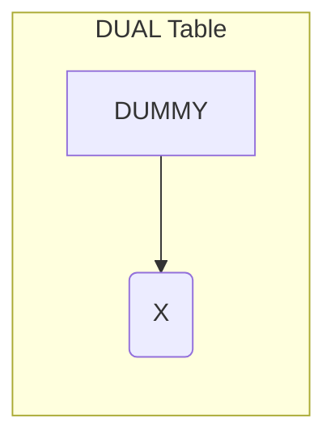

## 오라클에서 시퀀스 이용한 단일 행 반환 방법 (feat. DUAL 테이블)
> 작성날짜: 25.03.10

- 가장 일반적인 방법은 `DUAL 테이블`을 사용하는 것
- DUAL을 사용하는 이유는 단 하나의 행만 생성하기 위함입니다. DUAL 테이블은 항상 정확히 1개의 행만 반환하는 특수한 테이블이기 때문

### DUAL 테이블과 NEXTVAL 사용
```sql
SELECT 시퀀스이름.NEXTVAL FROM DUAL;

-- 실제 예시
SELECT MY_SEQUENCE.NEXTVAL FROM DUAL;
```

#### 다중행은 ??
- 그냥 DUAL 없이 실제 테이블 사용

```sql
INSERT INTO EMPLOYEES_BACKUP (ID, NAME, DEPT)
SELECT EMPLOYEE_SEQ.NEXTVAL, NAME, DEPT
FROM EMPLOYEES
WHERE HIRE_DATE > '2023-01-01';
```

---
### 👨‍🌾 DUAL 테이블이란
- DUAL 테이블은 오라클에서 단일 행과 단일 열을 가지도록 미리 정의된 특수한 테이블
  - 단일 행: 오직 한 개의 행만 존재합니다.
  - 단일 열: DUMMY라는 이름의 VARCHAR2(1) 타입의 열 하나만 존재하며, 그 값은 항상 'X'입니다.




- 위 그림에서 볼 수 있듯이, DUAL 테이블은 DUMMY라는 열에 'X'라는 값을 가진 단 하나의 행으로 구성


#### 언제 사용할까?
- `테이블에 의존하지 않고 함수를 실행하거나 표현식을 평가할 때:` 오라클 SQL은 SELECT 문을 사용하려면 반드시 테이블을 지정해야 합니다. 하지만 테이블과 관련 없이 단순히 함수를 실행하거나 계산 결과를 얻고 싶을 때 DUAL 테이블을 사용하면 됩니다.
- `시퀀스(Sequence)의 다음 값을 얻을 때:` 시퀀스는 테이블과는 독립적으로 증가하는 숫자 생성기입니다. 시퀀스의 다음 값을 얻기 위해 DUAL 테이블을 사용할 수 있습니다.
- `시스템 정보를 조회할 때:` 오라클 데이터베이스의 시스템 정보(현재 날짜, 사용자 이름 등)를 조회할 때 DUAL 테이블을 활용할 수 있습니다.

#### DUAL 테이블 사용 예시
##### 1. 현재 날짜 조회
> 이 쿼리는 현재 날짜와 시간을 반환합니다. SYSDATE는 오라클 내장 함수이며, 테이블에 의존하지 않고 실행될 수 있습니다.

```sql
SELECT SYSDATE FROM DUAL;
```

##### 2. 문자열 연결
> 이 쿼리는 'Hello'와 ' World'라는 문자열을 연결하여 'Hello World'라는 결과를 반환

```sql
SELECT 'Hello' || ' World' FROM DUAL;
```

##### 3. 시퀀스 다음 값 조회
```sql
SELECT MY_SEQUENCE.NEXTVAL FROM DUAL;
```


#### 장점!
```
간단함: 사용법이 매우 간단하고 직관적입니다.
편리함: 테이블 없이 함수를 실행하거나 값을 조회할 수 있어 편리합니다.
유연함: 다양한 내장 함수 및 표현식과 함께 사용할 수 있습니다.
```

#### 결론
- 오라클 데이터베이스에서 테이블에 의존하지 않고 함수를 실행하거나 표현식을 평가해야 할 때 매우 유용한 도구
